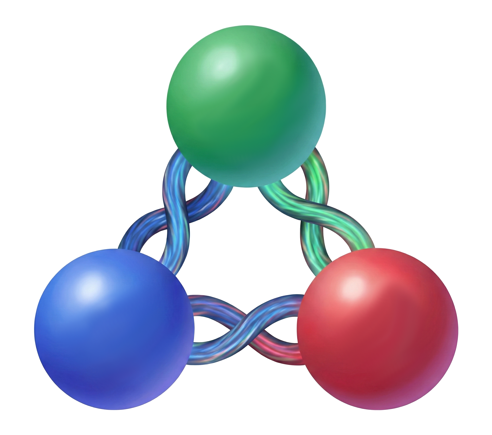

<div align="center">
  
  <h1>Quantum Braid Dynamics (QBD)</h1>
  <p><strong>A Computational Framework for Emergent Spacetime and Topological Matter</strong></p>
  
  <a href="https://braiddynamics.com">Website</a> • 
  <a href="https://braiddynamics.com/monograph">The Monograph</a> • 
  <a href="https://x.com/BraidDynamics">X (Twitter)</a>
</div>

---

## Overview

**Quantum Braid Dynamics (QBD)** is a background-independent theoretical framework that unifies General Relativity and the Standard Model of particle physics as emergent behaviors of a discrete computational substrate. 

Modern physics is defined by a deep incompatibility between the smooth, continuous geometry of spacetime (Relativity) and the discrete, probabilistic nature of matter (Quantum Mechanics). QBD resolves this tension by abandoning the spacetime continuum. Instead, reality is modeled as a **Directed Acyclic Graph (DAG)** governed by localized, stochastic rewrite rules.

This repository hosts both the **Python simulation engine** used to computationally verify the QBD axioms and the **Docusaurus source code** for the official QBD web portal. 

***Note:** The code in this repository is proprietary and provided strictly for academic verification. See the License section below for details.*

## Core Theoretical Pillars

1. **Spacetime is a Tensor Network:** The vacuum is a tripartite spin-network in thermodynamic equilibrium. The Einstein Field Equations emerge as the hydrodynamic equation of state for this network, where gravitational curvature is strictly identified with the local density of computational updates.
2. **Matter is Topological:** Fermions and gauge bosons are not point-like excitations in a pre-existing field. They are stable, irreducible topological twists (braids) in the graph itself.
3. **Physics is Fault Tolerance:** The universe persists because the graph acts as a macroscopic Quantum Error-Correcting Code (QECC). The laws of physics are algorithmic fault-tolerance protocols protecting the graph's topological integrity from vacuum fluctuations.

## Repository Structure

The repository is divided into two primary domains: the theoretical simulations and the web portal.

```text
qbd-portal/
├── code/
│   ├── model/                # Core QBD graph dynamics engine
│   │   ├── config.py         # Anchored physical constants (ALPHA, T_VACUUM)
│   │   ├── dynamics.py       # The Universal Constructor & Rewrite rules
│   │   ├── graph_setup.py    # Zero-Point Information (ZPI) vacuum generation
│   │   ├── observables.py    # Macroscopic measurements (Density, N3 count)
│   │   ├── qecc.py           # Awareness Comonad & local geometric stress
│   │   └── utils.py          # Topological constraint checks (PUC, AEC)
│   ├── simulations/          # Executable experiments
│   │   ├── repo/             # Simulations from the Monograph
│   │   ├── sweep.py          # Phase space sweep for the Region of Physical Viability
│   │   ├── ensemble.py       # Statistical ensemble runner
│   ├── tests/                # pyTest unit tests and code verification
├── docs/                     # Markdown source files for the Monograph
├── src/                      # React components for the Docusaurus frontend
├── static/                   # Images, diagrams, and LaTeX assets
├── docusaurus.config.ts      # Site configuration and KaTeX macros
└── package.json              # Node.js dependencies
```

## Running the Portal Locally

To view the monograph locally, you will need [Node.js](https://nodejs.org/) (version 20.0 or higher) installed.

1. Clone the repository and navigate into the project directory.
2. Install the frontend dependencies:
```bash
npm install

```


3. Start the local development server:
```bash
npm run start

```


## Author & Citation

**Author:** R. Fisher, *Principal Investigator @ Braid Dynamics* **ORCID:** [0009-0006-2441-3282](https://orcid.org/0009-0006-2441-3282)

We encourage the citation and discussion of this work. Please use the following format when referencing this material:

> **Fisher, R (2025).** *Quantum Braid Dynamics: A Computational Process*

## License & Usage Restrictions

**© 2025 Braid Dynamics. All Rights Reserved.**

This repository and its contents are **NOT OPEN SOURCE**. The simulation code, algorithms, and QECC implementations are proprietary technology.

Permission is granted to view, read, compile, and run the source code **strictly for personal, educational, and academic research purposes** to verify the theoretical results presented in the monograph.

**You may NOT:**

* Copy, modify, distribute, sublicense, or sell the code in source or binary form.
* Use the code or any derivative works for any commercial purpose (including but not limited to quantum computing hardware, cryptographic systems, or simulation engines).

For commercial licensing inquiries, joint ventures, or industrial applications, please contact the author directly via the repository owner profile.