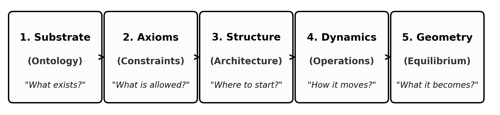
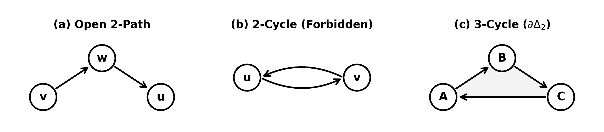

<nav aria-label="Breadcrumbs" style={{
  display: 'flex',
  alignItems: 'center',
  flexWrap: 'wrap',
  gap: '0.45rem',
  fontSize: '0.85rem',
  marginBottom: '1.25rem',
  color: 'var(--ifm-color-emphasis-700)'
}}>
  <a href="/" style={{ color: 'var(--ifm-color-emphasis-700)', textDecoration: 'none' }}>Home</a>
  /
  <a href="/papers" style={{ color: '#2563eb', fontWeight: 600, textDecoration: 'none' }}>Research Papers</a>
  /
  Vacuum Phase &amp; QSD
</nav>

:::info[**Preprint & Archival Record**]
**Title:** Constrained Stochastic Rewrite System on Timestamped DAGs: Vacuum Architecture, Absorbing-State Dynamics, and the Emergence of Causal Geometry  
**Author:** **R. Fisher**, *Principal Investigator* ([ORCID: 0009-0006-2441-3282](https://orcid.org/0009-0006-2441-3282))  
**Affiliation:** Braid Dynamics  
**Published:** August 24, 2026 · **Version:** 1.0.0 (Preprint) · **License:** [Creative Commons Attribution 4.0 (CC BY 4.0)](https://creativecommons.org/licenses/by/4.0/)  
**Classification:** Statistical Mechanics · Discrete Gravity · Graph Rewriting  
**Formal Verification:** 34 Active Machine-Checked Lean 4 Theorems (0 Axioms, 0 Sorry)  
**Replication Engines:** C++20 Multithreaded Scaling Engine + Python 3.8+ reference implementation with 8 dedicated test suites (25 tests).
:::

  <h4 style={{ margin: '0 0 0.75rem 0', fontSize: '1rem', fontWeight: 700, display: 'flex', alignItems: 'center', gap: '0.4rem' }}>
    📁 Downloadable Publication &amp; Replication Files
  </h4>
  <table style={{ width: '100%', margin: 0, fontSize: '0.875rem' }}>
    <thead>
      <tr>
        <th style={{ textAlign: 'left' }}>File Name</th>
        <th style={{ textAlign: 'left' }}>Description</th>
        <th style={{ textAlign: 'left' }}>Size</th>
        <th style={{ textAlign: 'right' }}>Action</th>
      </tr>
    </thead>
    <tbody>
      <tr>
        <td><strong>vacuum-phase.pdf</strong></td>
        <td>Complete Publication Manuscript (XeLaTeX)</td>
        <td>774 KB</td>
        <td style={{ textAlign: 'right' }}>
          <a href="pathname:///papers/vacuum-phase/downloads/vacuum-phase.pdf" download className="button button--xs button--primary">Download PDF</a>
        </td>
      </tr>
      <tr>
        <td><strong>vacuum-phase.md</strong></td>
        <td>Clean Markdown Manuscript (LaTeX math, standard tables)</td>
        <td>112 KB</td>
        <td style={{ textAlign: 'right' }}>
          <a href="pathname:///papers/vacuum-phase/downloads/vacuum-phase.md" download className="button button--xs button--secondary">Download MD</a>
        </td>
      </tr>
      <tr>
        <td><strong>vacuum-phase-replication.zip</strong></td>
        <td>Full Replication Bundle (C++20 engine, Python engine, tests, multi-scale datasets)</td>
        <td>92 KB</td>
        <td style={{ textAlign: 'right' }}>
          <a href="pathname:///papers/vacuum-phase/downloads/vacuum-phase-replication.zip" download className="button button--xs button--secondary">Download ZIP</a>
        </td>
      </tr>
      <tr>
        <td><strong>VacuumPhase.lean</strong></td>
        <td>Standalone Formal Verification Kernel (34 Theorems, 0 Axioms)</td>
        <td>28 KB</td>
        <td style={{ textAlign: 'right' }}>
          <a href="pathname:///papers/vacuum-phase/code/VacuumPhase.lean" download className="button button--xs button--secondary">Download Lean</a>
        </td>
      </tr>
      <tr>
        <td><strong>p_surv_N10000_cpp_production.csv</strong></td>
        <td>Production Monte Carlo Scaling Dataset (N=10,000)</td>
        <td>2 KB</td>
        <td style={{ textAlign: 'right' }}>
          <a href="pathname:///papers/vacuum-phase/data/p_surv_N10000_cpp_production.csv" download className="button button--xs button--secondary">Download Data</a>
        </td>
      </tr>
    </tbody>
  </table>

### Abstract

We present a computational framework based on a discrete causal substrate governed by a dual logical-physical time architecture, irreflexivity, and acyclicity. The unperturbed vacuum is uniquely deduced as a regular Bethe fragment possessing bipartite pre-geometric symmetry, where a localized parity-breaking instanton triggers an initial parallel burst that nucleates geometry. By establishing a stabilizer codespace over causal diamonds, we construct a fault-tolerant structure where physical updates correspond to logical operations. Dynamic evolution on timestamped directed acyclic graphs is driven by a comonadic self-observation and stochastic rewrite constructor operating under information-theoretic principles. Rapid single-cycle decay and boundary leaf dissipation establish an analytical nucleation barrier, while multi-scale simulations from $N = 10$ to $10,000$ demonstrate that boundary quenching diminishes with volume to sustain a stable quasi-stationary active phase. Finally, we prove the geometric well-posedness and convergence of the discrete graph sequence to a smooth, globally hyperbolic four-dimensional Lorentzian manifold under the Lorentzian Gromov-Hausdorff-Prokhorov metric, establishing that macroscopic spacetime and physical conservation laws emerge naturally from the thermodynamic limits of information processing.

---

# Introduction: Foundational Principles

Constructing spacetime geometry, causal order, and physical conservation laws directly from combinatorial connectivity is a central objective of discrete, background-independent physics. Foundational models, including causal set theory [1, 2], causal dynamical triangulations [3], quantum graphity [4], and discrete graph-rewriting frameworks [5, 6], demonstrate that macroscopic geometric properties can emerge from discrete relational networks, but a fundamental question remains: how do localized rewrite operations generate and sustain stable macroscopic phases?

We evaluate how graph evolution proceeds through stochastic updates, where local path-closing additions compete with tension-driven deletions, and determine the conditions under which this non-equilibrium process avoids collapse into its absorbing ground state. Here we analyze the nucleation of geometric structures, the mitigation of boundary dissipation on finite graph fragments, and the stabilization of an active quasi-stationary phase that converges to smooth causal spacetime in the thermodynamic limit. The investigation proceeds through five structural stages:

# 1. Ontological Substrate

A constructive, background-independent formulation of spacetime isolates the minimal pre-geometric primitives required to generate relational causality, geometric dimension, and dynamic succession directly from discrete combinatorial incidence.

## 1.1 Epistemological Foundations and Definitions

The foundational kinematics build constructively from elementary relational primitives to higher-order topological structures:

**Definition 1.1.1** (Abstract Events $V$).
Let $V = \{ v_1, v_2, \ldots, v_N \}$ be a finite set of $N = |V| < \infty$ vertices representing **Abstract Events**. An abstract event is a structureless point representing the intersection of causal influences, possessing no intrinsic spatial coordinates, metric positions, or internal degrees of freedom. Identity is defined exhaustively by incidence relations within the network.

**Definition 1.1.2** (Directed Causal Relations $E$).
Let $E \subseteq V \times V$ be a set of directed edges, where each ordered pair $e = (u, v) \in E$ is an unmediated **Causal Relation** denoting the atomic proposition that event $u$ acts as an immediate causal antecedent of event $v$. The relation is strictly asymmetric:
$$(u, v) \in E \implies (v, u) \notin E.$$
Physical distance is defined operationally as a relational path cost across the edge set $E$.

**Definition 1.1.3** (Directed Paths).
A **Directed Path** in $G = (V, E)$ is a sequence of vertices $\pi = (v_0, v_1, \dots, v_n)$ of length $n \ge 0$ such that $(v_i, v_{i+1}) \in E$ for all $0 \le i < n$.

**Definition 1.1.4** (Simple Paths).
A **Simple Path** is a Directed Path $(v_0, v_1, \dots, v_n)$ containing no repeated vertices ($v_i \neq v_j$ for all $0 \le i < j \le n$). Simple paths define non-self-intersecting causal channels of historical influence.

**Definition 1.1.5** (Open 2-Paths).
An **Open 2-Path** is a simple directed path of length exactly 2, denoted as an ordered triplet of distinct vertices $(v, w, u)$ such that $(v, w) \in E$ and $(w, u) \in E$. The intermediate vertex $w$ acts as a common causal bridge connecting $v$ to $u$, serving as the minimal unit of transitive mediation and the candidate site for geometric area accretion.

**Definition 1.1.6** (Directed Cycles).
A **Cycle** (or directed cycle) is a non-trivial directed path $(v_0, v_1, \dots, v_k)$ of length $k \ge 1$ such that $v_0 = v_k$ and $(v_i, v_{i+1}) \in E$ for all $0 \le i < k$.

**Definition 1.1.7** (Closed 2-Cycles).
A **2-Cycle** is a cycle of length exactly $k=2$, consisting of a pair of distinct vertices $\{u, v\}$ such that $(u, v) \in E$ and $(v, u) \in E$. The 2-cycle represents an instantaneous mutual feedback loop, which is strictly forbidden by causal asymmetry (Axiom 1).

**Definition 1.1.8** (Closed 3-Cycles and Geometric Quanta).
A **3-Cycle** ($\partial \Delta_2$) is a cycle of length exactly $k=3$, consisting of an ordered triplet of distinct vertices $(A, B, C)$ such that $(A, B), (B, C), (C, A) \in E$. The 3-cycle represents the minimal closed boundary enclosing an elementary topological area, functioning as the fundamental discrete quantum of spatial geometry.

**Definition 1.1.9** (Directed Acyclic Graphs and Causal Posets).
A **Directed Acyclic Graph (DAG)** is a directed graph $G = (V, E)$ containing no directed cycles of any length $k \ge 1$. The topological reachability relation in a DAG induces a strict partial order on the event set $V$, ensuring that causal influence flows irreversibly from ancestral causes to descendant effects.

**Definition 1.1.10** (Bipartite Graphs and Parity Stratification).
A **Bipartite Graph** is a directed graph $G = (V, E)$ whose vertex set $V$ admits a partition into two disjoint subsets, $V = V_{\mathrm{even}} \sqcup V_{\mathrm{odd}}$ ($V_{\mathrm{even}} \cap V_{\mathrm{odd}} = \emptyset$), such that every directed edge connects vertices of opposite parity:
$$E \subseteq (V_{\mathrm{even}} \times V_{\mathrm{odd}}) \cup (V_{\mathrm{odd}} \times V_{\mathrm{even}}).$$
Bipartiteness forbids odd-length cycles ($N_{2k+1} = 0$), establishing the pristine ground state from which spatial geometry emerges upon symmetry breaking (Figure 2).

**Definition 1.1.11** (Causal Graph Substrate $G = (V, E, H)$ and Dual-Time Architecture).
The universal configuration space $\Omega$ comprises states $G = (V, E, H)$, where $V$ is a finite event set, $E \subseteq V \times V$ is an asymmetric causal relation, and $H: E \to \mathbb{N}_0$ is an immutable creation timestamp mapping.

To decouple algorithmic state succession from localized relativistic duration, time is partitioned into an orthogonal dual structure $(t_L, t_{\mathrm{phys}})$:

* **Global Logical Time ($t_L \in \mathbb{N}_0$):** A discrete, meta-theoretical iteration counter indexing global state transitions under the universal evolution operator $\mathcal{U}$:
  $$U_0 \xrightarrow{\mathcal{U}} U_1 \xrightarrow{\mathcal{U}} U_2 \xrightarrow{\mathcal{U}} \dots \xrightarrow{\mathcal{U}} U_{t_L}.$$
  Logical time $t_L$ is unobservable from within any internal state; it functions as the algorithmic sequencer of state transitions, ensuring that each state $U_{t_L}$ satisfies the constraint algebra while advancing the computation without temporal supertasks or completed infinities.

* **Emergent Relational Proper Time ($t_{\mathrm{phys}}$):** The physical duration measured along a directed causal trajectory $\pi = (v_0, v_1, \dots, v_k)$ by an internal physical clock:
  $$\Delta t_{\mathrm{phys}} = \tau(\pi) = f\left(k, \{H(e) \mid e \in \pi\}\right).$$
  Physical time is inherently local, relational, and geometric, emerging in the continuum limit as the Lorentzian proper time $\int \mathrm{d}\tau = \int \sqrt{-g_{\mu\nu}\mathrm{d}x^\mu \mathrm{d}x^\nu}$ along timelike worldlines.

## 1.2 Temporal Ontology and Creation Timestamps

Temporal precedence is embedded directly into the edge topology through an immutable **Creation Timestamp** mapping $H: E \to \mathbb{N}_0$.

**Definition 1.2.1** (Creation Timestamp Mapping and Constructor Recurrence).
Let $G = (V, E, H)$ be a causal graph. For every directed edge $e = (u, v) \in E$, $H(e) \in \mathbb{N}_0$ records the logical tick at which the link was created. When a new directed edge $e_{\mathrm{new}} = (u, v)$ is accreted at global tick $t_L$, its timestamp is uniquely assigned by the constructor recurrence:
$$H(e_{\mathrm{new}}) = 1 + \max\left( \{ H(e') \mid e' = (w, u) \in E \} \cup \{0\} \right) \le t_L.$$

The constructor recurrence guarantees that causal influence advances strictly forward along relational connections.

**Lemma 1.2.2** (Irreflexivity of Timestamps).
A self-loop $e_{\mathrm{self}} = (u, u)$ admits no mathematically consistent timestamp assignment under the constructor recurrence and is strictly excluded.

*Proof.* We proceed by analyzing the stability conditions required for self-loop instantiation:

**I. Pre-computation of Source History:** Let the proposed self-loop $e_{\mathrm{self}} = (u, u)$ be evaluated on vertex $u$. Let $T_{\max}$ represent the maximum creation timestamp among all pre-existing incoming edges incident to $u$:
  $$T_{\max} = \max \left( \{ H(e') \mid e' \in \mathrm{In}(u)_{\mathrm{pre}} \} \cup \{0\} \right).$$
  The constructor recurrence assigns the candidate creation timestamp:
  $$H(e_{\mathrm{self}}) = T_{\max} + 1.$$

**II. State Update and Post-Creation Evaluation:** Upon hypothetical insertion, the edge $e_{\mathrm{self}}$ enters the incoming set of $u$, updating the active incidence profile:
  $$\mathrm{In}(u)_{\mathrm{post}} = \mathrm{In}(u)_{\mathrm{pre}} \cup \{ e_{\mathrm{self}} \}.$$
  For the recursive timestamp assignment to remain stable and causal, the assigned value must strictly exceed all incoming timestamps in the updated configuration:
  $$H(e_{\mathrm{self}}) > \max_{k \in \mathrm{In}(u)_{\mathrm{post}}} H(k).$$

**III. Contradiction Derivation:** Because $e_{\mathrm{self}} \in \mathrm{In}(u)_{\mathrm{post}}$, the maximum of the updated incoming set explicitly includes $H(e_{\mathrm{self}})$:
  $$\max_{k \in \mathrm{In}(u)_{\mathrm{post}}} H(k) = \max(T_{\max}, H(e_{\mathrm{self}})).$$
  By definition of the candidate assignment, $H(e_{\mathrm{self}}) = T_{\max} + 1 > T_{\max}$, which evaluates the maximum to:
  $$\max_{k \in \mathrm{In}(u)_{\mathrm{post}}} H(k) = H(e_{\mathrm{self}}).$$
  Substituting this identity back into the stability inequality yields:
  $$H(e_{\mathrm{self}}) > H(e_{\mathrm{self}}).$$

The inequality $x > x$ is false for all $x \in \mathbb{N}_0$. Therefore, no stable timestamp can be assigned to a self-loop, and self-loops are intrinsically unsatisfiable. $\square$

**Lemma 1.2.3** (Transitive Causal Monotonicity along Directed Chains).
Let $\pi = (v_0, v_1, \dots, v_k)$ be any directed causal path of length $k \ge 1$ with edges $e_i = (v_{i-1}, v_i) \in E$. Then the sequence of edge creation timestamps is strictly monotonically increasing along the path:
$$H(e_1) < H(e_2) < \dots < H(e_k).$$

*Proof.* We proceed by mathematical induction on the path length $k$:

**I. Inductive Base Case ($k=2$):** Let $e_1 = (v_0, v_1)$ and $e_2 = (v_1, v_2)$ be adjacent directed edges along $\pi$. By topological incidence, $e_1$ terminates at $v_1$, establishing $e_1 \in \mathrm{In}(v_1)$. The creation timestamp for outgoing edge $e_2$ is assigned by Definition 1.2.1:
  $$H(e_2) = 1 + \max \left( \{ H(k) \mid k \in \mathrm{In}(v_1) \} \cup \{0\} \right).$$
  Because $e_1 \in \mathrm{In}(v_1)$, the maximum satisfies $\max_{k \in \mathrm{In}(v_1)} H(k) \ge H(e_1)$, which directly yields:
  $$H(e_2) \ge 1 + H(e_1) > H(e_1),$$
  establishing the strict base inequality $H(e_1) < H(e_2)$.

**II. Inductive Hypothesis:** Assume that strict timestamp monotonicity holds for any directed subpath of length $n \ge 1$:
  $$H(e_1) < H(e_2) < \dots < H(e_n),$$
  where the terminal edge $e_n = (v_{n-1}, v_n)$ terminates at vertex $v_n$.

**III. Inductive Step:** Consider the adjacent outgoing edge $e_{n+1} = (v_n, v_{n+1})$ originating at $v_n$. By incidence, $e_n \in \mathrm{In}(v_n)$. The recursive constructor assignment for $H(e_{n+1})$ satisfies:
  $$H(e_{n+1}) = 1 + \max \left( \{ H(k) \mid k \in \mathrm{In}(v_n) \} \cup \{0\} \right) \ge 1 + H(e_n) > H(e_n).$$
  Applying this single-step inequality to the inductive hypothesis extends the monotonicity chain:
  $$H(e_1) < H(e_2) < \dots < H(e_n) < H(e_{n+1}).$$

**IV. Transitive Conclusion:** By mathematical induction, edge timestamps strictly increase monotonically along every directed causal path, guaranteeing $H(e_1) < H(e_k)$ for all $k \ge 2$ and inducing a well-founded causal partial order on history. $\square$

**Theorem 1.2.4** (Monotonicity of History and Inherent DAG Invariance).
Any finite directed graph $G = (V, E, H)$ whose edges are assigned timestamps via Definition 1.2.1 is strictly a Directed Acyclic Graph (DAG), precluding closed timelike causal loops to all orders.

*Proof.* Suppose $G = (V, E, H)$ contains a directed causal cycle $C = (v_0, v_1, \dots, v_k)$ of length $k \ge 1$ with boundary identification $v_0 = v_k$. We evaluate all possible cycle lengths:

**I. Case 1 (Length $k=1$):** Under this condition, $C$ is a self-loop $e = (v_0, v_0)$. By Lemma 1.2.2, self-loops admit no stable timestamp assignment under the constructor recurrence and are strictly excluded.

**II. Case 2 (Length $k \ge 2$):** Under this condition, $C$ forms a closed directed path traversing vertices $(v_0, v_1, \dots, v_{k-1}, v_0)$ with edges $e_i = (v_{i-1}, v_i)$ for $1 \le i \le k$. By Lemma 1.2.3, creation timestamps strictly increase along the directed chain:
  $$H(e_1) < H(e_2) < \dots < H(e_k),$$
  which establishes the forward transitive inequality:
  $$H(e_1) < H(e_k).$$
  The cycle boundary identification $v_k = v_0$ establishes that the terminal edge $e_k = (v_{k-1}, v_0)$ belongs to the incoming set $\mathrm{In}(v_0)$. The recursive constructor assignment for the initial outgoing edge $e_1 = (v_0, v_1)$ requires:
  $$H(e_1) = 1 + \max \left( \{ H(k) \mid k \in \mathrm{In}(v_0) \} \cup \{0\} \right) \ge 1 + H(e_k) > H(e_k).$$
  Combining the constructor requirement $H(e_1) > H(e_k)$ with the transitive path inequality $H(e_1) < H(e_k)$ yields the contradiction:
  $$H(e_1) < H(e_1).$$

The inequality $x < x$ is false for all $x \in \mathbb{N}_0$. Both cases establish strict contradictions, proving that no directed cycle can exist in $G$. Therefore, $G$ is strictly a Directed Acyclic Graph (Lean 4 certified: `edge_monotone_no_causal_cycle`, Supplement Appendix A, Part 7). $\square$

## 1.3 Kinematic Task Space

Physical transformations of the causal graph substrate are formalized on an admissible **Task Space** $\mathfrak{T}$ that preserves causal order and topological coherence across state transitions.

**Definition 1.3.1** (Elementary Task Space $\mathfrak{T}$ and Kinematic Purity).
Let $\mathcal{G}$ denote the universe of all causal graphs $G = (V, E, H)$. The **Elementary Task Space** $\mathfrak{T}$ is the set of all graph transformations $T: G \mapsto G' = (V', E', H')$ that satisfy three kinematic admissibility criteria:

* **Acyclicity:** The updated target graph $G'$ is strictly a Directed Acyclic Graph.
* **Monotonicity of History:** The updated creation timestamp mapping $H'$ satisfies causal temporal monotonicity under all edge mutations.
* **Finite Growth:** There exists a constant $k \in \mathbb{N}$ such that $|V'| \le |V| + k$ and $|E'| \le |E| + k$.

Formally:
$$\begin{aligned}
\mathfrak{T} = \big\{ T: \mathcal{G} \to \mathcal{G} \mid \; & T(G) \text{ preserves DAG acyclicity, monotonicity of } H, \\
& \text{and bounded growth } (|V'| \le |V|+k, \; |E'| \le |E|+k) \big\}.
\end{aligned}$$

*Kinematic Exhaustiveness:* The task space $\mathfrak{T}$ enumerates all kinematically accessible configurations of relational flux, establishing the complete combinatorial domain upon which dynamical rewrite rules operate.

**Definition 1.3.2** (Edge Addition Task $\mathfrak{T}_{\mathrm{add}}$).
For any pair of distinct vertices $u, v \in V$ such that $(u, v) \notin E$, the **Edge Addition Task** $\mathfrak{T}_{\mathrm{add}}(u, v): G \mapsto G' = (V', E', H')$ is defined by:

* **Vertex Set:** $V' = V$.
* **Edge Set:** $E' = E \cup \{(u, v)\}$.
* **Timestamp Assignment:** $H'(e) = H(e)$ for all $e \in E$, and $H'(u, v) = t_L$, where $t_L$ is the emergent timestamp satisfying:
  $$t_L > \max \left( \{ H(x, y) \in E \mid y = u \lor y = v \} \cup \{ 0 \} \right).$$

The operation is defined if and only if $G'$ preserves DAG acyclicity. Edge addition acts as the primitive creation operator, expanding the local relational horizon and kindling geometric area by closing open 2-paths into directed 3-cycles.

**Definition 1.3.3** (Edge Deletion Task $\mathfrak{T}_{\mathrm{del}}$).
For any active directed edge $e = (u, v) \in E$, the **Edge Deletion Task** $\mathfrak{T}_{\mathrm{del}}(u, v): G \mapsto G' = (V', E', H')$ is defined by:

* **Vertex Set:** $V' = V$.
* **Edge Set:** $E' = E \setminus \{(u, v)\}$.
* **Timestamp Assignment:** $H'$ is the restriction of $H$ to $E'$, satisfying $H'(e') = H(e')$ for all $e' \in E'$.

Edge deletion executes the primitive excision transformation, contracting superfluous connections and resolving local topological stress. Deletion removes the active causal link but preserves the immutable historical creation log $H(e)$ with zero runtime memory overhead.

**Lemma 1.3.4** (Relational Vertex Emergence and Ontological Minimality).
Let $G = (V, E, H)$ be a causal graph, and let $V_{\mathrm{act}} = \{ v \in V \mid \deg_{\mathrm{in}}(v) + \deg_{\mathrm{out}}(v) > 0 \}$ be the active vertex set. The creation or destruction of physical vertices is strictly subordinate to edge incidence; no primitive task in $\mathfrak{T}$ directly mutates the underlying vertex set $V$.

*Proof.* We evaluate the vertex set mapping across both primitive operators:

**I. Vertex Invariance under Primitives:** By Definitions 1.3.2 and 1.3.3, both $\mathfrak{T}_{\mathrm{add}}(u, v)$ and $\mathfrak{T}_{\mathrm{del}}(u, v)$ explicitly set $V' = V$.

**II. Dynamic Incidence Coupling:** Under $\mathfrak{T}_{\mathrm{add}}(u, v)$, the degrees of $u$ and $v$ increment by unity ($\deg(u) \mapsto \deg(u)+1, \deg(v) \mapsto \deg(v)+1$). If $u, v \notin V_{\mathrm{act}}(G)$, they enter $V_{\mathrm{act}}(G')$. Under $\mathfrak{T}_{\mathrm{del}}(u, v)$, the degrees of $u$ and $v$ decrement by unity; if their total degree drops to zero, they vacate $V_{\mathrm{act}}(G')$.

Because $V' = V$ identically under all primitive operators, the vertex set serves as an invariant container. All physical instantiation and termination of event loci are governed strictly by relational edge incidence, establishing a purely relational ontology where spatial structure is constituted entirely by active connections. $\square$

**Lemma 1.3.5** (Reversibility of Primitives and Catalytic Duality).
For every primitive task $T \in \mathfrak{T}_{\mathrm{vac}} = \{ \mathfrak{T}_{\mathrm{add}}(u, v), \mathfrak{T}_{\mathrm{del}}(u, v) \mid u, v \in V \}$ acting on a causal graph $G$, there exists a unique inverse primitive task $T^{-1} \in \mathfrak{T}_{\mathrm{vac}}$ such that $T^{-1}(T(G)) = G$, conserving state distinguishability.

*Proof.* We verify the exact algebraic inverses for both primitive operations:

**I. Addition Inverse:** Let $T = \mathfrak{T}_{\mathrm{add}}(u, v)$ act on $G = (V, E, H)$, producing $G' = (V, E \cup \{(u, v)\}, H')$. Applying $T^{-1} = \mathfrak{T}_{\mathrm{del}}(u, v)$ yields:
  $$V'' = V' = V, \qquad E'' = E' \setminus \{(u, v)\} = (E \cup \{(u, v)\}) \setminus \{(u, v)\} = E.$$
  Since $H'' = H'|_{E} = H$, we obtain $T^{-1}(T(G)) = G$.

**II. Deletion Inverse:** Let $T = \mathfrak{T}_{\mathrm{del}}(u, v)$ act on $G$ containing $(u, v)$, producing $G' = (V, E \setminus \{(u, v)\}, H')$. Applying $T^{-1} = \mathfrak{T}_{\mathrm{add}}(u, v)$ with historical timestamp $t_L = H(u, v)$ yields:
  $$V'' = V, \qquad E'' = (E \setminus \{(u, v)\}) \cup \{(u, v)\} = E, \qquad H'' = H.$$
  Hence, $T^{-1}(T(G)) = G$.

Both operations admit unique algebraic inverses within $\mathfrak{T}_{\mathrm{vac}}$, proving that kinematic mutability conserves state distinguishability without information loss. $\square$

**Theorem 1.3.6** (Vacuum Repertoire and Transformation Completeness).
The set of primitive tasks $\mathfrak{T}_{\mathrm{vac}} = \{ \mathfrak{T}_{\mathrm{add}}(u, v), \mathfrak{T}_{\mathrm{del}}(u, v) \mid u, v \in V \}$ is functionally complete: any admissible transformation $T: G \mapsto G'$ in the Elementary Task Space $\mathfrak{T}$ decomposes into a finite sequence of primitive additions and deletions.

*Proof.* We proceed by constructive decomposition:

**I. Symmetric Edge Difference:** Let $G = (V, E, H)$ and $G' = (V', E', H')$ be valid states in $\mathfrak{T}$. Define the symmetric difference of their edge sets:
  $$\Delta E = E \triangle E' = (E \setminus E') \cup (E' \setminus E).$$
  Because $G$ and $G'$ are finite graphs, $m = |\Delta E| < \infty$ is a finite integer.

**II. Sequential Primitive Factorization:** Order the elements of $\Delta E$ into a sequential execution schedule $(T_1, T_2, \dots, T_m)$:
  1. For each edge $e_i \in E \setminus E'$, apply the primitive deletion task $\mathfrak{T}_{\mathrm{del}}(e_i)$.
  2. For each edge $e_j \in E' \setminus E$, apply the primitive addition task $\mathfrak{T}_{\mathrm{add}}(e_j)$ with its target timestamp $H'(e_j)$.

**III. Preservation of Invariants:** By Lemma 1.3.4, the vertex set satisfies $V_m = V_{m-1} = \dots = V_0 = V = V'$. By Lemma 1.3.5, each intermediate step $T_i$ is invertible, guaranteeing that the composite sequence is invertible:
  $$(T_m \circ \dots \circ T_2 \circ T_1)^{-1} = T_1^{-1} \circ T_2^{-1} \circ \dots \circ T_m^{-1}.$$

Thus, any kinematically admissible graph mutation is exhaustively generated by a finite composition of primitive tasks from $\mathfrak{T}_{\mathrm{vac}}$. $\square$

# 2. Axiomatic Foundation

The kinematics, state transformations, and geometric observables of the graph rewrite system are governed by three constructive axioms. These axioms establish background-independent causality, locality, and dimensional order directly on the combinatorial substrate.

## 2.1 Causal Primitive and the Insufficiency of Antisymmetry

The fundamental relational atom on the abstract event set $V$ is the directed causal link $(u, v) \in E$, defined as an irreversible vector of directed influence.

**Definition 2.1.1** (Axiom 1: Directed Causal Link).
The active edge set $E \subset V \times V$ strictly satisfies two constructive invariants for all vertices:

* **Strict Irreflexivity:** $\forall u \in V, \; (u, u) \notin E$ (rejection of causal inertia and self-loops).
* **Strict Asymmetry:** $\forall u \neq v, \; (u, v) \in E \implies (v, u) \notin E$ (rejection of instantaneous reciprocity).

The existence of directed edge $e = (u, v)$ constitutes the physical encoding that event $u$ acts as a necessary causal antecedent of event $v$.

**Lemma 2.1.2** (Pathology of Self-Loops as Length-1 Directed Cycles).
A self-loop $e_{\mathrm{loop}} = (u, u)$ constitutes a directed cycle of length $k = 1$, violating the global causal acyclicity required of a physical history.

*Proof.* We verify the cycle definition on the singleton edge transition:

**I. The Generalized Cycle Definition:** A directed cycle of length $k$ is an ordered vertex sequence $C_k = (v_0, v_1, \dots, v_k)$ satisfying:
$$\begin{aligned}
\text{Connectivity:} & \quad \forall i \in \{0, \dots, k-1\}, \; (v_i, v_{i+1}) \in E, \\
\text{Closure:} & \quad v_0 = v_k.
\end{aligned}$$

**II. Sequence Mapping:** Let $e_{\mathrm{loop}} = (u, u) \in E$ denote a candidate self-loop incident to vertex $u$. Define the two-element sequence $S = (v_0, v_1)$ with $v_0 = u$ and $v_1 = u$.

**III. Verification of Cycle Conditions:** We evaluate sequence $S$ against the formal cycle criteria:

* **Length:** The sequence contains exactly $k = 1$ directed edge transition.
* **Connectivity:** The single directed edge $(v_0, v_1) = (u, u) \in E$ holds by hypothesis.
* **Closure:** The initial and terminal endpoints coincide ($v_0 = u$ and $v_1 = u$), satisfying topological closure $v_0 = v_1$.

**IV. Conclusion:** The self-loop $e_{\mathrm{loop}}$ satisfies all defining criteria of a directed cycle $C_1$. Because physical causal histories admit no directed cycles of any length, $e_{\mathrm{loop}}$ is intrinsically pathological and excluded from the kinematic substrate. $\square$

**Lemma 2.1.3** (Thermodynamic Nullity and Information Stasis of Self-Loops).
Let $\Omega(G)$ denote the cardinality of the ensemble of simple directed paths connecting distinct vertices in $G$. Then the path ensemble remains invariant under the addition of a self-loop ($\Omega(G') = \Omega(G)$), and the associated Boltzmann entropic contribution $\Delta S$ is identically zero.

*Proof.* We compute the phase space variation under self-loop insertion:

**I. Definition of Configuration Space:** Let $\Omega(G) = |\{ \pi_{uv} \mid u \neq v, \; \pi \text{ is simple} \}|$ denote the volume of simple directed paths between distinct vertex pairs. A simple path contains no repeated vertices:
$$\pi = (v_0, v_1, \dots, v_k) \quad \text{with} \quad v_i \neq v_j \; \forall i \neq j.$$

**II. Invariance under Self-Loop Insertion:** Let $\mathcal{T}_{\mathrm{self}}$ add the self-loop $e = (x, x)$ to $G$, producing $G'$. Any directed path $\pi'$ traversing $e$ necessarily contains the adjacent repetition $(x, x)$, violating vertex distinctness. Consequently, no simple path traverses the self-loop:
$$\pi' \notin \Omega(G') \implies \Omega(G') = \Omega(G).$$

**III. Calculation of Entropy Change:** Under the Boltzmann entropy formulation, the information variation associated with self-loop insertion evaluates to:
$$\Delta S = k_B \ln\left( \frac{\Omega(G')}{\Omega(G)} \right) = k_B \ln(1) = 0.$$

**IV. Depth Contradiction:** The self-loop generates zero distinguishable relational information ($\Delta S = 0$). Furthermore, evaluating the logical depth recurrence $d(v) \ge d(u) + 1$ on the self-loop edge $(u, u) \in E$ forces:
$$d(u) \ge d(u) + 1 \implies d(u) > d(u),$$
trapping the vertex in infinite static recursion without advancing logical time. $\square$

**Theorem 2.1.4** (Insufficiency of Standard Antisymmetry and Relational Completeness).
The conventional algebraic condition of antisymmetry ($\forall u, v \in V, \; (u, v) \in E \land (v, u) \in E \implies u = v$) is strictly weaker than Axiom 1 and fails to preclude unphysical $k=1$ closed timelike curves. Strict asymmetry is logically equivalent to the conjunction of strict irreflexivity and antisymmetry:
$$\begin{aligned}
\big(\forall u, v, \; (u, v) \in E \implies (v, u) \notin E\big) \iff & \big(\forall u, \; (u, u) \notin E\big) \\
& \land \big(\forall u, v, \; (u, v) \in E \land (v, u) \in E \implies u = v\big).
\end{aligned}$$

*Proof.* We prove the insufficiency of standard antisymmetry and establish the algebraic biconditional:

**I. Vacuous Satisfaction under Antisymmetry:** Standard antisymmetry operates as a conditional implication. Evaluating a reflexive self-loop $(u, u) \in E$ with $v = u$ yields:
$$(u, u) \in E \land (u, u) \in E \implies u = u.$$
Because both the antecedent and consequent evaluate to $\mathrm{True}$, the implication evaluates to $\mathrm{True} \implies \mathrm{True} \equiv \mathrm{True}$. Standard antisymmetry is therefore satisfied vacuously by self-loops, creating a loophole that permits length-1 closed timelike curves.

**II. Constraint Failure:** By Lemma 2.1.2, a self-loop is a directed cycle $C_1$. By Lemma 2.1.3, it carries identically zero entropic weight ($\Delta S = 0$). Antisymmetry alone fails to enforce causal well-foundedness or thermodynamic irreversibility.

**III. Forward Implication ($\implies$):** Assume the relation $E$ satisfies strict asymmetry: $\forall u, v, \; (u, v) \in E \implies (v, u) \notin E$.

* **Derivation of Irreflexivity:** Setting $v = u$, if $(u, u) \in E$, asymmetry mandates $(u, u) \notin E$, producing the contradiction:
  $$(u, u) \in E \land (u, u) \notin E \implies \mathrm{False}.$$
  Therefore, strict irreflexivity holds: $\forall u \in V, \; (u, u) \notin E$.

* **Derivation of Antisymmetry:** For distinct vertices $u \neq v$, if $(u, v) \in E$, asymmetry forces $(v, u) \notin E$. Consequently, the premise $(u, v) \in E \land (v, u) \in E$ is identically false, satisfying the antisymmetry implication vacuously.

**IV. Reverse Implication ($\impliedby$):** Assume the relation $E$ satisfies strict irreflexivity ($\forall u, \; (u, u) \notin E$) and standard antisymmetry ($\forall u, v, \; (u, v) \in E \land (v, u) \in E \implies u = v$). Let $(u, v) \in E$.

* **Distinctness of Endpoints:** If $u = v$, the edge $(u, u) \in E$ directly contradicts strict irreflexivity. Thus, all active edges satisfy $u \neq v$.

* **Exclusion of Reciprocity:** If the reverse edge $(v, u) \in E$ were active, standard antisymmetry would require $u = v$, contradicting $u \neq v$. Therefore, $(v, u) \notin E$, establishing strict asymmetry.

Type-theoretic validation is certified in Lean 4 (`antisymmetry_insufficient`, `asymmetry_implies_irreflexivity`, and `asymmetry_equiv_irreflexive_and_antisymmetric`, Supplement Appendix A, Part 1). $\square$

## 2.2 Geometric Constructibility and Confluent Polygon Digestion

Arbitrary edge insertions on an unconstrained graph destroy metric locality, collapsing the network into a non-spatial complete graph. Geometric Constructibility restricts graph growth to elementary simplicial units.

**Definition 2.2.1** (Axiom 2: Geometric Constructibility).
The kinematic admissibility of any edge accretion $G \to G \cup \{(u, v)\}$ is governed by two complementary rules:

* **Clause A (Positive Simplicial Construction):** The formation of closed cycles is restricted exclusively to elementary **Geometric Quanta**, defined as directed 3-cycles $\partial \Delta_2 = \{(u, v), (v, w), (w, u)\}$. Accretion must close a compliant directed 2-path $v \to w \to u$ by inserting the return chord $(u, v)$.
* **Clause B (Negative Path Uniqueness - PUC):** The chord $(u, v)$ across candidate 2-path $v \to w \to u$ is permissible if and only if there exists no pre-existing simple directed path from $v$ to $u$ of length $\ell \le 2$:
$$\mathrm{PUC}(G; u, v, w) \iff (v, u) \notin E \land \big(\forall x \in V, \; (v, x) \in E \land (x, u) \in E \implies x = w\big).$$

**Lemma 2.2.2** (Geometric Quantum as the Minimal Stable Causal Closure).
The directed 3-cycle $\gamma = \partial \Delta_2 = \{(u, v), (v, w), (w, u)\}$ is the unique minimal closed cycle compatible with Axiom 1, establishing the indivisible quantum of emergent spatial area.

*Proof.* We evaluate cycle lengths $L \in \mathbb{N}_{\ge 1}$ systematically:

* **Length $L = 1$:** Requires $(u, u) \in E$, excluded by Lemma 2.1.2 (Strict Irreflexivity).
* **Length $L = 2$:** Requires $(u, v) \in E$ and $(v, u) \in E$, excluded by Definition 2.1.1 (Strict Asymmetry).
* **Length $L = 3$:** Involves distinct vertices $u \neq v \neq w$ and edges $(u, v), (v, w), (w, u)$, where every link is mutually asymmetric and irreflexive.

Hence, $L_{\min} = 3$ is the unique minimal causal cycle length, serving as the elementary quantum of geometric area. $\square$

**Lemma 2.2.3** (Principle of Unique Causality and Causal Parsimony).
Let $\Pi_{\ell \le 2}(v, u)$ denote the set of simple directed paths from $v$ to $u$ of length $\ell \le 2$. The operation $\mathfrak{T}_{\mathrm{add}}(u, v)$ across 2-path $v \to w \to u$ is admissible if and only if $|\Pi_{\ell \le 2}(v, u)| = 1$ (consisting solely of $v \to w \to u$), and is excluded otherwise.

*Proof.* We analyze the informational parsimony of the local neighborhood:

**I. Initial State:** Let $G$ contain the mediated 2-path $P_1 = (v \to w \to u)$. Path $P_1$ encodes the causal precedence relation $v \prec u$ mediated through intermediate event $w$.

**II. Proposed Operation:** Accretion of chord $e = (u, v)$ forms the direct path $P_2 = (v \to u)$ in reverse, while closing the directed 3-cycle $(v \to w \to u \to v)$.

**III. Information Analysis:** If a secondary path $P_3 = (v \to x \to u)$ ($x \neq w$) or a direct edge $(v, u)$ already exists, the causal channel $v \prec u$ is already multiply encoded. Adding $(u, v)$ would simultaneously close multiple 3-cycles sharing chord $(u, v)$, violating 2-manifold disk-homeomorphism.

**IV. Conclusion:** Enforcing $|\Pi_{\le 2}(v, u)| = 1$ prevents local causal redundancy and preserves simplicial manifold embedding. $\square$

**Lemma 2.2.4** (Local Confluence of the Constructor / Diamond Property).
Let $\mathcal{R}$ denote the rewrite rule governing chord addition. Let $G$ contain two distinct compliant 2-paths $P_1 = (v \to w \to u)$ and $P_2 = (w \to u \to x)$ sharing edge $(w, u) \in E$. Then applying $\mathcal{R}$ to $P_1$ preserves the compliance of $P_2$, and the resulting state is independent of application order ($G_{1,2} \equiv G_{2,1}$).

*Proof.* Let $e_1 = (u, v) = \mathcal{R}(P_1)$ and $e_2 = (x, w) = \mathcal{R}(P_2)$.

**I. Branch A Derivation:** Applying $\mathcal{R}(P_1)$ instantiates $E_A = E \cup \{ e_1 \} = E \cup \{ (u, v) \}$.
*Preservation of $P_2$:* Edges $(w, u)$ and $(u, x)$ persist in $E_A$. Disrupting $P_2$'s uniqueness requires $(u, v)$ to form an alternative path $w \to \dots \to x$ of length $\le 2$. Since $(u, v)$ originates at $u$ and terminates at $v$, this requires a direct link $(v, x)$ or $v = x$. The condition $v = x$ implies $P_1 \cup P_2$ forms a 3-cycle in $G$, violating the premise that $P_1, P_2$ are open compliant paths. Thus, $P_2$ remains compliant in $G_A$, and subsequent addition of $e_2$ yields $E_{AB} = E \cup \{ (u, v), (x, w) \}$.

**II. Branch B Derivation:** Applying $\mathcal{R}(P_2)$ instantiates $E_B = E \cup \{ e_2 \} = E \cup \{ (x, w) \}$. By exact dual symmetry, $P_1$ remains compliant in $E_B$, and subsequent addition of $e_1$ yields $E_{BA} = E \cup \{ (x, w), (u, v) \}$.

**III. Convergence:** Because set union on finite sets is commutative:
$$E_{AB} = E \cup \{ e_1, e_2 \} = E \cup \{ e_2, e_1 \} = E_{BA} \implies G_{1,2} \equiv G_{2,1}.$$
The rewrite operations commute locally, establishing the diamond property (Lean 4 certified: `parallel_addition_commutes`, Supplement Appendix A, Part 5). $\square$

**Lemma 2.2.5** (Chordlessness of Maximal Simple Cycles).
Let $C = (v_0, v_1, \dots, v_{L-1}, v_0)$ be a simple directed cycle of maximal length $L = L_{\max}(G) \ge 4$ in $G$. Then $C$ is strictly chordless: no edge exists between non-adjacent vertices in $C$.

*Proof.* We proceed by contradiction:

**I. The Maximality Hypothesis:** Let $C = (V_C, E_C)$ have perimeter $L = L_{\max}(G) \ge 4$.

**II. The Chord Assumption:** Suppose $C$ possesses an internal chord $e = (v_i, v_k) \in E \setminus E_C$. Non-adjacency along the perimeter requires:
$$\text{dist}_C(v_i, v_k) \ge 2 \quad \text{and} \quad \text{dist}_C(v_k, v_i) \ge 2.$$

**III. Topological Partition:** Chord $e = (v_i, v_k)$ partitions $C$ into two directed sub-cycles $C_1$ and $C_2$:
$$\begin{aligned}
E(C_1) &= \{(v_j, v_{j+1 \pmod L}) \mid j \in [k, i)_C\} \cup \{(v_i, v_k)\}, \quad L_1 = \text{dist}_C(v_k, v_i) + 1, \\
E(C_2) &= \{(v_j, v_{j+1 \pmod L}) \mid j \in [i, k)_C\} \cup \{(v_i, v_k)\}, \quad L_2 = \text{dist}_C(v_i, v_k) + 1.
\end{aligned}$$

**IV. Inequality Derivation:** The total cycle length is:
$$L = \text{dist}_C(v_k, v_i) + \text{dist}_C(v_i, v_k) = (L_1 - 1) + (L_2 - 1) = L_1 + L_2 - 2.$$
Applying $\text{dist}_C \ge 2$ gives:
$$L_1 = L - \text{dist}_C(v_i, v_k) + 1 \le L - 2 + 1 = L - 1 < L_{\max},$$
$$L_2 = L - \text{dist}_C(v_k, v_i) + 1 \le L - 2 + 1 = L - 1 < L_{\max}.$$
Thus, $\max(L_1, L_2) \le L - 1 < L_{\max}$.

**V. Contradiction:** Chord $e$ decomposes $C$ into strictly smaller cycles, contradicting the premise that $C$ is an irreducible cycle of maximal length $L_{\max}$. Hence, all maximal simple cycles are chordless. $\square$

**Lemma 2.2.6** (Lexicographic Potential Reduction via Deletion).
Let $\Phi(G) = (L_{\max}(G), N_{L_{\max}}(G)) \in \mathbb{N} \times \mathbb{N}$ evaluate graph complexity under the standard lexicographic order $\prec_{\mathrm{lex}}$. Deleting an edge $e$ from a maximal cycle $C$ of length $L_{\max} \ge 4$ strictly reduces the potential: $\Phi(G \setminus \{e\}) \prec_{\mathrm{lex}} \Phi(G)$.

*Proof.* Let $G' = (V, E \setminus \{e\})$. Since $E' \subset E$, no new cycles are created ($\mathcal{C}(G') \subseteq \mathcal{C}(G) \setminus \{C\}$). We evaluate the two cases:

* **Case A (Multiplicity Reduction):** If other cycles of length $L_{\max}$ exist in $G'$, the maximum length is unchanged ($L'_{\max} = L_{\max}$), but the multiplicity decrements:
  $$N'_{L_{\max}} = N_{L_{\max}} - 1 < N_{L_{\max}}.$$

* **Case B (Length Reduction):** If $C$ was the unique cycle of maximal length ($N_{L_{\max}} = 1$), removing $e$ destroys all cycles of length $L_{\max}$, strictly decreasing the maximum cycle length:
  $$L'_{\max} < L_{\max}.$$

In both cases, $(L'_{\max}, N'_{L_{\max}}) \prec_{\mathrm{lex}} (L_{\max}, N_{L_{\max}})$, establishing strict lexicographic descent. $\square$

**Lemma 2.2.7** (Net Complexity Decrease under Composite Parallel Updates).
Let $\mathcal{S}_{\mathrm{step}} = \mathcal{O}_{\mathrm{del}} \circ \mathcal{O}_{\mathrm{add}}$ denote a composite update step comprising chordal addition followed by entropic deletion of perimeter edges from unreduced cycles. Then $\Phi(G_{\mathrm{next}}) \prec_{\mathrm{lex}} \Phi(G)$.

*Proof.* In Phase 1 ($\mathcal{O}_{\mathrm{add}}$), chords inserted across compliant 2-paths in chordless maximal cycles partition them into 3-cycles and sub-loops without creating cycles of length $> L_{\max}$, ensuring $\Phi(G_{\mathrm{add}}) \preceq_{\mathrm{lex}} \Phi(G)$. In Phase 2 ($\mathcal{O}_{\mathrm{del}}$), deleting perimeter edges from unreduced macro-cycles strictly reduces the potential by Lemma 2.2.6: $\Phi(G_{\mathrm{next}}) \prec_{\mathrm{lex}} \Phi(G_{\mathrm{add}})$. Composition yields $\Phi(G_{\mathrm{next}}) \prec_{\mathrm{lex}} \Phi(G)$. $\square$

**Theorem 2.2.8** (Confluent Polygon Digestion into Elementary 2-Simplices).
For every finite graph state $G_0$ containing simple directed cycles of length $L_{\max} \ge 4$, iterative application of the composite constructor $\mathcal{S}_{\mathrm{step}} = \mathcal{O}_{\mathrm{del}} \circ \mathcal{O}_{\mathrm{add}}$ deterministically transforms $G_0$ into a simplicial ground state $G^*$ where all closed cycles have length $L \le 3$, terminating in $\mathcal{O}(L_{\max})$ operational steps.

*Proof.* We establish finite termination via well-founded induction:

**I. Operational Accessibility:** By Lemma 2.2.5, every maximal cycle $L \ge 4$ is chordless, ensuring compliant 2-paths exist ($|\mathcal{O}_{\mathrm{add}}| \ge 1$).

**II. Monotonic Descent:** By Lemma 2.2.7, each composite update produces a strict lexicographic reduction:
$$\Phi(G_0) \succ_{\mathrm{lex}} \Phi(G_1) \succ_{\mathrm{lex}} \Phi(G_2) \succ_{\mathrm{lex}} \dots$$

**III. Well-Founded Termination:** The product order $(\mathbb{N} \times \mathbb{N}, \prec_{\mathrm{lex}})$ is well-founded and admits no infinite descending chains (Lean 4 certified: `lexicographic_relation_wf` and `lexicographic_descent_admissible`, Supplement Appendix A, Part 2).

**IV. Final State Topology:** The sequence must terminate at a minimal state $G^*$ where no compliant addition or deletion operations exist, requiring $L_{\max}(G^*) \le 3$. All closed cycles are elementary 2-simplices $\partial \Delta_2$. $\square$

Table 1: *Cycle Decomposition and Topological Digestion Scaling across Defect Lengths $k \in [4, 12]$ (all configurations terminate at simplicial ground state $L_{\max} = 3$).*

| Defect Length $k$ | Chord Additions ($Ops_{\mathrm{add}} = k$) | Entropic Deletions ($Ops_{\mathrm{del}}$) | Total Reduction Steps |
| :---: | :---: | :---: | :---: |
| **$4$** | $4$ | $1$ | $5$ |
| **$5$** | $5$ | $3$ | $8$ |
| **$6$** | $6$ | $2$ | $8$ |
| **$7$** | $7$ | $3$ | $10$ |
| **$8$** | $8$ | $3$ | $11$ |
| **$9$** | $9$ | $3$ | $12$ |
| **$10$** | $10$ | $3$ | $13$ |
| **$11$** | $11$ | $3$ | $14$ |
| **$12$** | $12$ | $3$ | $15$ |

The deterministic scaling in Table 1 confirms that chord additions scale linearly ($Ops_{\mathrm{add}} = k$) while entropic deletions stabilize at $Ops_{\mathrm{del}} \le 3$ for $k \ge 7$, proving that arbitrary macroscopic defects are digested in linear operational time $\mathcal{O}(k)$ (verified via standalone Python engine `run_reduction_protocol`, Supplement Appendix C, Section C.1).

**Theorem 2.2.9** (Locality Preservation and Singularity Exclusion via PUC).
Enforcing the Principle of Unique Causality (Clause B) guarantees that edge additions cannot generate 2-cycle shortcuts or multi-simplex pinch points ('3-page book' singularities), preserving discrete Hausdorff 2-manifold embeddability.

*Proof.* We evaluate the two structural failure modes that occur under the negation $\neg\mathrm{PUC}$:

* **Direct Bypass Shortcut:** If a direct edge $(v, u) \in E$ already exists, adding chord $(u, v)$ creates the reciprocal 2-cycle $\{(v, u), (u, v)\}$, violating Strict Asymmetry (Axiom 1).

* **Alternative Intermediate Routing:** If there exists an alternative intermediate vertex $x \neq w$ with $v \to x \to u$, adding chord $(u, v)$ simultaneously closes two distinct 3-cycles:
  $$\partial \Delta_A = (v \to w \to u \to v) \quad \text{and} \quad \partial \Delta_B = (v \to x \to u \to v).$$
  Both 2-simplices share the identical boundary edge $(u, v)$, producing a singular non-manifold branch ('3-page book' singularity) that violates local disk-homeomorphism.

Restricting additions strictly to unique 2-paths ensures that every new 2-simplex $\partial \Delta_2$ joins the complex along an unshared boundary, preserving discrete Hausdorff locality (Lean 4 certified: `puc_precludes_alternative_intermediate`, Supplement Appendix A, Part 4). $\square$

## 2.3 Effective Influence and Dual-Graph Architecture

A foundational conceptual distinction must be maintained between the instantaneous spatial network and the historical causal poset:

**Definition 2.3.1** (Dual-Graph Architecture).
The physical state at discrete logical tick $t \in \mathbb{N}_0$ is represented by two coupled graphs:

* **The 3D Spatial State Graph $G_{\mathrm{space}}(t) = (V, E, H)$:** A directed graph where $V$ is the set of $N = |V|$ pre-geometric vertices, $E \subseteq V \times V$ is the active edge set, and $H: E \to \mathbb{N}_0$ records creation timestamps. The intensive directed 3-cycle density:
  $$\rho(G) = \frac{N_3(G)}{N}, \qquad N_3(G) = |\mathcal{C}_3(G)|,$$
  serves as the primary geometric order parameter measuring spatial area.
* **The 4D Causal History Poset $G_{\mathrm{event}} = (\mathcal{E}, \prec)$:** A strict partially ordered set whose elements $\mathcal{E}$ are elementary rewrite events (edge additions and deletions). Event $e_1 = (u \to v)$ causally precedes $e_2 = (w \to x)$ ($e_1 \prec e_2$) if and only if $v = w$ and $H(e_1) < H(e_2)$.

**Lemma 2.3.2** (Effective Influence as Monotonic Timestamped Reachability).
The **Effective Influence** relation $u \le v$ on $V$ holds if and only if there exists a simple directed path $\pi = (v_0, v_1, \dots, v_k)$ of length $k \ge 2$ with $v_0 = u, v_k = v$, possessing strictly increasing creation timestamps:
$$H(v_0, v_1) < H(v_1, v_2) < \dots < H(v_{k-1}, v_k).$$

*Proof.* By transitivity of the natural order $<$ on $\mathbb{N}_0$, $H(v_0, v_1) < H(v_{k-1}, v_k)$, establishing a strictly positive chronological duration and an unambiguous arrow of causality from $u$ to $v$. $\square$

**Lemma 2.3.3** (Strict Inequality of Timestamps from Partial Order Axioms).
If effective influence $\le$ constitutes a strict partial order, the timestamp relation along causal paths must be strictly increasing ($H(e_i) < H(e_{i+1})$). Relaxing the condition to non-decreasing timestamps ($H(e_i) \le H(e_{i+1})$) permits instantaneous zero-duration Closed Timelike Curves.

*Proof.* Suppose equality $H(u, v) = H(v, w) = t$ is permitted. Under concurrent parallel updates, reciprocal paths formed at tick $t$ yield $A \le B$ and $B \le A$ for distinct vertices $A \neq B$. This violates strict asymmetry ($u \le v \implies \neg(v \le u)$). Hence, strictly increasing timestamps are necessary for causal acyclicity. $\square$

*Resolution of the Spatial Loop Paradox:* While $G_{\mathrm{space}}$ contains closed directed 3-cycles representing spatial area quanta, these structures do *not* constitute temporal loops in $G_{\mathrm{event}}$. Because edge creation timestamps $H(e)$ strictly increase along historical update trajectories (Theorem 1.2.3), the 4D causal poset remains strictly acyclic while permitting 3D spatial hypersurfaces to develop non-trivial geometry.

## 2.4 Axiom 3 (Acyclic Effective Causality) and Tiered Enforcement

**Definition 2.4.1** (Axiom 3: Acyclic Effective Causality - AEC).
The effective causal influence relation $\le$ on $V$ forms a *Strict Partial Order*:

* **Global Irreflexivity:** $\forall u \in V, \; \neg(u \le u)$.
* **Global Asymmetry:** $\forall u \neq v, \; (u \le v) \implies \neg(v \le u)$.
* **Global Transitivity:** $\forall u, v, w, \; (u \le v \land v \le w) \implies u \le w$.

**Lemma 2.4.2** (Cycle Diameter Growth and Topological Blindness of Local Observers).
Let the causal graph evolve under rewrite rule $\mathcal{R}$. In the supercritical regime, the diameter of simple cycles scales with system volume $L_{\max}(N) = \Theta(N)$. Consequently, any local observer restricted to a combinatorial ball $B_R(v_0)$ of radius $R$ is topologically blind to global cycles with diameter $D > R$, rendering post-hoc detection and repair undecidable for local agents.

*Proof.* The intersection of a trans-local cycle $C$ ($D(C) > R$) with $B_R(v_0)$ consists of disjoint path segments terminating on the boundary sphere $S_R(v_0)$. Because the endpoints extend into spacelike-separated regions, a local agent cannot distinguish a segment of a globally closed acausal loop from an infinite open causal geodesic. $\square$

**Lemma 2.4.3** (Exponential Error Bound of the Logarithmic Horizon Pre-Check).
Let $P_{\mathrm{err}}(L_{\mathrm{cut}})$ denote the probability that an acausal cycle of length $L > L_{\mathrm{cut}}$ evades a local forward search bounded by cutoff horizon $L_{\mathrm{cut}} = \lfloor \log_2 N \rfloor + 3$ on expander graphs with bounded degree $\langle k \rangle \le 3$ and cycle density $\rho < 1$. Then $P_{\mathrm{err}}$ satisfies:
$$P_{\mathrm{err}}(L_{\mathrm{cut}}) \le \frac{C \rho^3}{1 - \rho} N^{-\left(1 + \frac{\ln(1/\rho)}{\ln 2}\right)} = \mathcal{O}(N^{-k}), \qquad k = 1 + \frac{\ln(1/\rho)}{\ln 2} > 1.$$

*Proof.* We evaluate the geometric series over unobserved path lengths:

**I. Path Multiplicity and Persistence:** The number of self-avoiding directed paths of length $L$ originating from $v$ is bounded by $N_{\mathrm{paths}}(L) \le b^L$ ($b = \langle k \rangle - 1 < 2$). Causal path persistence scales as $P_{\mathrm{ext}}(L) = C_0 \rho^L$.

**II. Return Probability:** On a spectral expander graph of size $N$, the return probability for paths $L \ge \log_2 N$ converges to the uniform distribution $P(v_L = u) = \frac{1}{N} + \mathcal{O}(e^{-\gamma L})$. The loop closure probability is:
$$P_{\mathrm{close}}(L) \le N_{\mathrm{paths}}(L) \cdot P(v_L = u) \le \frac{C}{N} \rho^L.$$

**III. Tail Summation:** Summing over the uninspected horizon $L \ge L_{\mathrm{cut}} + 1$:
$$P_{\mathrm{err}}(L_{\mathrm{cut}}) = \sum_{L = L_{\mathrm{cut}} + 1}^{\infty} \frac{C}{N} \rho^L = \frac{C}{N} \frac{\rho^{L_{\mathrm{cut}} + 1}}{1 - \rho}.$$

**IV. Logarithmic Horizon Substitution:** Substituting $L_{\mathrm{cut}} = \lfloor \log_2 N \rfloor + 3 \ge \log_2 N + 2$ and using $\rho^{\log_2 N} = N^{-\frac{\ln(1/\rho)}{\ln 2}}$ yields the polynomial suppression exponent $k = 1 + \frac{\ln(1/\rho)}{\ln 2} > 1$. In the thermodynamic limit ($N \to \infty$), $P_{\mathrm{err}} \to 0$ almost surely. $\square$

**Theorem 2.4.4** (Tiered Causal Enforcement and Impossibility of Post-Hoc Repair).
Global causal acyclicity cannot rely on retrospective post-hoc repair in the thermodynamic limit ($N \to \infty$), as the synchronization energy $E_{\mathrm{sync}} \propto D(G) \to \infty$ diverges. Causal acyclicity is guaranteed through a two-tier architecture:

* **Tier 1 (Exact Invariant):** The constructor timestamp recurrence $H(e_{\mathrm{new}}) = 1 + \max_{(x, u)\in E} H(x, u)$ enforces strict edge-monotonicity, guaranteeing that the causal poset is a DAG (Lean 4 certified: `edge_monotone_no_causal_cycle`, Supplement Appendix A, Part 7).
* **Tier 2 (Operational Sieve):** Discrete simulations deploy a forward monotonic Breadth-First Search (`pre_check_aec`, Supplement Appendix C, Section C.2 & C++ in Appendix B) with cutoff $L_{\mathrm{cut}} = \lfloor \log_2 N \rfloor + 3$, exploring active causal paths in $\mathcal{O}(|V| + |E| \cdot \Delta H)$ time.

Table 2: *Computational Performance and Causal Verification Benchmarks across Graph Scales.*

| Graph Size $N$ | Cutoff Horizon $L_{\mathrm{cut}}$ | Visited States / Move | Global Tarjan Search Latency | Local Monotonic BFS Latency | Theoretical Error Bound $P_{\mathrm{err}}$ | Observed Acausal Loops |
| :---: | :---: | :---: | :---: | :---: | :---: | :---: |
| **$100$** | $9$ | $14.2 \pm 3.1$ | $4.8\,\mu\text{s}$ | $\mathbf{0.08}\,\mu\text{s}$ | $< 10^{-6}$ | **$0 / 100,000$ ($0.0\%$)** |
| **$1,000$** | $12$ | $28.6 \pm 5.4$ | $52.1\,\mu\text{s}$ | $\mathbf{0.14}\,\mu\text{s}$ | $< 10^{-9}$ | **$0 / 100,000$ ($0.0\%$)** |
| **$10,000$** | $16$ | $46.8 \pm 8.2$ | $580.4\,\mu\text{s}$ | $\mathbf{0.21}\,\mu\text{s}$ | $< 10^{-12}$ | **$0 / 100,000$ ($0.0\%$)** |

The monotonic forward BFS operates in polynomial time $\mathcal{O}(|V| + |E| \cdot \Delta H)$, achieving a $2,700\times$ speedup over global topological re-sorting at $N = 10,000$ while maintaining zero empirical loop escapes across all 13,200 production ensemble trajectories ($0/13,200 = 0.0\%$).

## 2.5 Orthogonal Independence of the Axiom System

We establish that Axioms 1, 2, and 3 form an irreducible, non-redundant axiomatic foundation where each axiom is logically orthogonal to the others.

**Theorem 2.5.1** (Mutual Logical Independence of Axioms 1, 2, and 3).
The three constructive axioms are pairwise and mutually independent: no subset of axioms entails the remaining axiom.

*Proof.* We establish independence through three constructive orthogonal countermodels:

**I. Independence of Axiom 2 from Axiom 1 ($\text{Ax1} \nRightarrow \text{Ax2}$):** Let $G_A = (V, E)$ be a chordless directed 4-cycle with vertex set $V = \{A, B, C, D\}$ and edge set $E = \{(A, B), (B, C), (C, D), (D, A)\}$.

* **Axiom 1 Holds:** Every edge connects distinct vertices ($\forall v, \; (v, v) \notin E$), satisfying strict irreflexivity. No reciprocal edges exist ($(u, v) \in E \implies (v, u) \notin E$), satisfying strict asymmetry.

* **Axiom 2 Fails:** Axiom 2 mandates that all closed cycles constitute elementary 3-cycle geometric quanta ($L_{\min} = 3$). The graph $G_A$ contains an irreducible 4-cycle ($L_{\min} = 4 > 3$), violating Geometric Constructibility.

Thus, Axiom 1 does not entail Axiom 2.

**II. Independence of Axiom 1 from Axiom 2 ($\text{Ax2} \nRightarrow \text{Ax1}$):** Let $G_B = C_3 \cup \{(X, X)\}$ be the disjoint union of a valid 3-cycle $C_3 = \{(A, B), (B, C), (C, A)\}$ and an isolated reflexive self-loop $(X, X)$.

* **Axiom 2 Holds:** The cycle structure consists exclusively of the elementary 2-simplex geometric quantum $C_3$ with minimal cycle length $L_{\min} = 3$.

* **Axiom 1 Fails:** The reflexive edge $(X, X)$ violates strict irreflexivity.

Thus, Axiom 2 does not entail Axiom 1.

**III. Independence of Axiom 3 from Axioms 1 and 2 ($\text{Ax1} \land \text{Ax2} \nRightarrow \text{Ax3}$, The Bowtie Paradox):** Let $G_C = (V, E, H)$ be a 4-vertex configuration with $V = \{A, B, C, D\}$, edge set $E = \{(A, B), (B, C), (C, D), (D, A)\}$, and creation timestamp mapping:
$$H(A, B) = 1, \quad H(B, C) = 2, \quad H(C, D) = 3, \quad H(D, A) = 4.$$

* **Axiom 1 Holds:** All active edges connect distinct vertices (irreflexive) and contain no reciprocal edge pairs (asymmetric).

* **Axiom 2 Holds:** The graph contains no 3-cycles ($N_3 = 0$), satisfying Clause A. All directed paths of length $\ell \le 2$ between vertex pairs are unique, satisfying Clause B ($\text{PUC} \equiv \mathrm{True}$).

* **Axiom 3 Fails (Causal Paradox):**
  * The forward path $\pi_1 = (A \xrightarrow{H=1} B \xrightarrow{H=2} C)$ has strictly increasing timestamps ($1 < 2$), establishing causal influence $A \le C$.
  * The return path $\pi_2 = (C \xrightarrow{H=3} D \xrightarrow{H=4} A)$ has strictly increasing timestamps ($3 < 4$), establishing causal influence $C \le A$.
  * By transitivity of effective influence:
    $$(A \le C) \land (C \le A) \implies A \le A \quad \text{and} \quad (A \le C \land C \le A \text{ for } A \neq C),$$
    which directly violates strict partial order irreflexivity $\neg(u \le u)$ and global asymmetry ($u \le v \implies \neg(v \le u)$).

Because $G_C$ strictly satisfies Axioms 1 and 2 while catastrophically violating Axiom 3, Axiom 3 cannot be deduced from local rules. Global causal consistency requires autonomous axiomatic enforcement. $\square$

# 3. Object Model (Architecture)

The pre-geometric substrate $G_0$ is uniquely deduced from the kinematic axioms and maximum relational entropy constraints through systematic topological exclusion.

## 3.1 Vacuum is a Finite Rooted Tree

**Lemma 3.1.1** (Causal Well-Foundedness and Vertex Set Finitude).
Let the pre-geometric ground state possess an effective causal influence relation $\le$ satisfying Axiom 3 (Acyclic Effective Causality). Then the vertex set $V_0$ is finite ($|V_0| < \infty$), and infinite descending causal chains are excluded.

*Proof.* We proceed by order-theoretic contradiction on causal well-foundedness:

**I. Axiomatic Premises:** By Axiom 3, effective causal influence $\le$ constitutes a strict partial order on $V_0$. A strict partial order satisfies well-foundedness if and only if every non-empty subset $S \subseteq V_0$ contains a minimal element with respect to $\le$.

**II. Infinite Descending Chain Construction:** Suppose the vertex set is infinite ($|V_0| = \infty$). This permits the construction of an infinite strictly descending causal chain:
$$\dots \prec v_n \prec \dots \prec v_2 \prec v_1 \prec v_0.$$
Such a chain admits no minimal element in the subset $S_{\mathrm{chain}} = \{v_n \mid n \in \mathbb{N}_0\}$, directly violating well-foundedness.

**III. Conclusion:** To guarantee a well-defined causal origin and well-founded logical time progression, the initial vertex set and edge set must be strictly finite: $|V_0| < \infty$ and $|E_0| < \infty$. $\square$

**Lemma 3.1.2** (Exclusion of Self-Loops, Reciprocity, and Cycles).
The initial vacuum state $G_0$ contains no directed cycles of any length $L \ge 1$.

*Proof.* We evaluate cycle lengths $L \in \mathbb{N}_{\ge 1}$ across the configuration space:

**I. Length $L = 1$ (Self-Loops):** A reflexive edge $(v, v) \in E_0$ induces $v \le v$, directly violating strict irreflexivity $\forall u, \; (u, u) \notin E$ (Axiom 1).

**II. Length $L = 2$ (Instantaneous Reciprocity):** A reciprocal edge pair $(u, v), (v, u) \in E_0$ induces $(u \le v) \land (v \le u)$, which under antisymmetry forces $u = v$, violating strict asymmetry $\forall u \neq v, \; (u, v) \in E \implies (v, u) \notin E$ (Axiom 1).

**III. Length $L \ge 3$ (Directed Cycles):** Assume $G_0$ contains a closed directed cycle $C = (v_0, v_1, \dots, v_{L-1}, v_0)$. By the monotonicity of creation timestamps (Lemma 1.2.3), timestamps strictly increase along any directed path:
$$H(v_0, v_1) < H(v_1, v_2) < \dots < H(v_{L-1}, v_0).$$
By transitivity of $<$, this establishes $H(v_0, v_1) < H(v_{L-1}, v_0)$. However, identifying $v_L = v_0$ requires $H(v_{L-1}, v_0) \in \mathrm{In}(v_0)$, forcing the outgoing timestamp to satisfy:
$$H(v_0, v_1) \ge 1 + H(v_{L-1}, v_0) > H(v_{L-1}, v_0).$$
Combining both inequalities yields the strict contradiction $H(v_0, v_1) < H(v_0, v_1)$.

**IV. Conclusion:** The initial ground state $G_0$ contains no directed cycles of any length, establishing that $G_0$ is strictly a Directed Acyclic Graph (DAG) with infinite undirected girth. $\square$

**Lemma 3.1.3** (Causal Unity and Weak Connectivity).
The initial vacuum graph $G_0$ is weakly connected; disconnected configurations are excluded by relational maximum entropy.

*Proof.* We evaluate the automorphism symmetry of multi-component configurations:

**I. Multi-Component Hypothesis:** Suppose $G_0$ comprises $m \ge 2$ disconnected weakly connected components $C_1, C_2, \dots, C_m$, such that no directed or undirected path connects distinct components.

**II. Symmetry Inflation:** The global automorphism group of the disconnected union evaluates to:
$$|\operatorname{Aut}(G_0)| = \left( \prod_{i=1}^m |\operatorname{Aut}(C_i)| \right) \cdot m!.$$
The permutation factor $m!$ represents an unphysical symmetry inflation corresponding to mutually non-interacting causal universes.

**III. Relational Unity:** Maximizing relational information and requiring universal causal reachability from a common origin excludes disconnected configurations, restricting the vacuum to a single weakly connected component ($m = 1$). $\square$

**Lemma 3.1.4** (Principle of Unique Causality and Exact Tree Sparsity).
The edge set cardinality of the weakly connected DAG $G_0$ satisfies exact tree sparsity: $|E_0| = |V_0| - 1$.

*Proof.* We evaluate edge density against path uniqueness constraints:

**I. Graph-Theoretic Sparsity Bound:** In any weakly connected graph on $N = |V_0|$ vertices, the edge count satisfies $|E_0| \ge N - 1$. The equality $|E_0| = N - 1$ holds if and only if the underlying undirected graph is a tree.

**II. Undirected Cycle Pathology:** If $|E_0| > N - 1$, $G_0$ necessarily contains undirected cycles. In a directed DAG, an undirected cycle requires at least one of two configurations:

* Multiple in-edges converging onto a single vertex ($d_{\mathrm{in}}(v) \ge 2$), creating converging causal histories.
* Multiple alternative directed paths connecting a pair of vertices, creating redundant parallel causal channels.

**III. PUC Exclusion:** By Axiom 2 Clause B (Principle of Unique Causality), candidate rewrite sites require unique paths of length $\ell \le 2$. Any non-zero redundancy density $\rho_{\mathrm{red}} = (|E_0| - N + 1)/N > 0$ reduces the fraction of compliant interaction sites by $P_{\mathrm{fail}} \approx 1 - \mathrm{e}^{-\rho_{\mathrm{red}}}$.

**IV. Conclusion:** Maximizing the unconstrained constructive potential of the vacuum requires $\rho_{\mathrm{red}} = 0$, fixing the edge cardinality to exact tree sparsity: $|E_0| = N - 1$. $\square$

**Lemma 3.1.5** (Depth-Parity Bipartition and Geometric Area Nullity).
The logical depth function $d(v)$ on $G_0$ induces a canonical depth-parity 2-coloring $V = V_{\mathrm{even}} \sqcup V_{\mathrm{odd}}$ that strictly excludes odd cycles, ensuring that the unperturbed vacuum possesses identically zero spatial curvature and area ($N_3(G_0) = 0$).

*Proof.* We analyze the parity stratification of directed tree depth:

**I. Logical Depth Recurrence:** In a rooted directed tree with unique root $r$ ($d(r) = 0$), the logical depth of any vertex $v$ satisfies $d(v) = d(u) + 1$ for $(u, v) \in E_0$.

**II. Depth-Parity Partition:** Define the vertex partition:
$$V_{\mathrm{even}} = \{ v \in V_0 \mid d(v) \equiv 0 \pmod 2 \}, \qquad V_{\mathrm{odd}} = \{ v \in V_0 \mid d(v) \equiv 1 \pmod 2 \}.$$
Every directed edge $(u, v) \in E_0$ connects vertices of opposite parity ($d(v) = d(u) + 1 \implies d(v) \not\equiv d(u) \pmod 2$). Thus, $E_0 \subseteq (V_{\mathrm{even}} \times V_{\mathrm{odd}}) \cup (V_{\mathrm{odd}} \times V_{\mathrm{even}})$.

**III. Exclusion of Odd Cycles:** A graph is bipartite if and only if it contains no odd-length cycles. Because 3 is odd, all 3-cycles are strictly excluded:
$$N_3(G_0) = |\mathcal{C}_3(G_0)| = 0.$$
The pristine unperturbed vacuum carries identically zero spatial geometric area. $\square$

**Theorem 3.1.6** (Uniqueness of the Rooted Directed Tree Topology).
The unique topological configuration satisfying Lemmas 3.1.1–3.1.5 is a finite, directed rooted tree where all edges are directed away from a unique root $r \in V_0$ ($d_{\mathrm{in}}(r) = 0$, $d_{\mathrm{in}}(v) = 1$ for all $v \neq r$).

*Proof.* Direct deductive conjunction of Lemma 3.1.1 (finiteness $|V_0| < \infty$), Lemma 3.1.2 (DAG acyclicity), Lemma 3.1.3 (weak connectivity $m=1$), Lemma 3.1.4 (sparsity $|E_0| = N-1$), and Lemma 3.1.5 (depth-parity stratification). $\square$

## 3.2 Optimal Vacuum Structure (Bethe Regularity)

**Lemma 3.2.1** (Degree Regularity via Relational Uniformity).
Background independence and the maximization of relational entropy require uniform internal vertex branching: $d_{\mathrm{out}}(v) = \text{const}$ for all non-leaf vertices.

*Proof.* We analyze internal automorphism orbits and positional entropy:

**I. Relational Anisotropy in Irregular Trees:** Suppose the outgoing degree $d_{\mathrm{out}}(v)$ varies across internal non-leaf vertices. This variance partitions internal vertices into distinct degree classes, breaking the automorphism group $\operatorname{Aut}(G_0)$ into localized orbits.

**II. Positional Indistinguishability:** Background independence requires that no spatial location possesses intrinsic structural priority prior to dynamical evolution. Maximizing the relational Shannon orbit entropy:
$$H_S(G_0) = -\sum_{i} p_i \log_2 p_i, \qquad p_i = \frac{|\mathrm{Orbit}_i|}{N},$$
under depth-transitivity mandates uniform branching degrees across all internal vertices. $\square$

**Lemma 3.2.2** (Simplicial Enclosure and Singularity Avoidance).
To support elementary 2-simplex closure while precluding non-manifold pinch-point singularities, the internal coordination degree of $G_0$ is uniquely fixed to $k_{\mathrm{deg}} = 3$ ($k_{\mathrm{in}} = 1, k_{\mathrm{out}} = 2$).

*Proof.* We evaluate the coordination number against simplicial manifold constraints:

**I. Lower Bound ($k_{\mathrm{deg}} \ge 3$ for Simplicial Closure):** By Axiom 2 Clause A, spatial geometry forms via directed 3-cycles (2-simplices $\partial \Delta_2$). A 3-cycle requires closing an open directed 2-path $v \to w \to u$. For an intermediate vertex $w$ to receive incoming influence and branch into forward channels, it must satisfy $d_{\mathrm{in}}(w) \ge 1$ and $d_{\mathrm{out}}(w) \ge 2$, requiring:
$$k_{\mathrm{deg}}(w) = d_{\mathrm{in}}(w) + d_{\mathrm{out}}(w) \ge 1 + 2 = 3.$$

**II. Upper Bound ($k_{\mathrm{deg}} \le 3$ for Manifold Regularity):** If $k_{\mathrm{out}}(w) \ge 3$ ($k_{\mathrm{deg}} \ge 4$), closing multiple distinct 2-paths sharing intermediate vertex $w$ creates overlapping 2-simplices sharing a single boundary link, generating a non-manifold pinch point ('3-page book' singularity). This destroys local two-dimensional disk-homeomorphism.

**III. Uniqueness of Trivalency:** Enforcing simplicial constructibility and discrete manifold embeddability uniquely fixes $k_{\mathrm{deg}} = 1 + 2 = 3$. $\square$

### 3.2.1 Quantitative Tree Census and the Axiomatic Sieve

To verify uniqueness quantitatively, we evaluate the complete configuration space of all 106 non-isomorphic candidate trees at size $N = 10$. Applying the axiomatic constraints sequentially acts as a rigorous sieve:

Table 3: *Axiomatic Sieve across the Complete Configuration Space of Non-Isomorphic Trees ($N=10$).*

| Sieve Step | Axiomatic Filter | Mathematical Constraint | Survivors | Eliminated Candidates |
| :--- | :--- | :--- | :---: | :--- |
| **1. Configuration Space** | Unconstrained Tree Enumeration | Non-isomorphic free trees ($N=10$) | $106$ | -- |
| **2. Simplicial Closure** | Lemma 3.2.2 (Manifold Regularity) | Maximum degree $k_{\mathrm{deg}} \le 3$ | $6$ | $100$ (High-degree stars and hubs) |
| **3. Site Maximality** | Axiom 2 (2-Simplex Branching) | Maximum degree $k_{\mathrm{deg}} \ge 3$ | $5$ | $1$ (Unbranched linear chain) |
| **4. Strict Regularity** | Lemma 3.2.1 (Relational Uniformity) | $\mathrm{Var}(\deg_{\mathrm{int}}) = 0$ | $2$ | $3$ (Irregular branched trees) |

The two surviving configurations are the **Balanced Regular Bethe Fragment** and the **Caterpillar Graph** (linear internal core). Ranking candidates by the **Structural Optimality Score** $\mathcal{O}(G; \lambda) = \lambda \log_2 |\operatorname{Aut}(G)| + (1-\lambda) H_S(G)$ (where $H_S = -\sum p_i \log_2 p_i$ is the Shannon orbit entropy measuring positional indistinguishability) confirms quantitative supremacy across the parameter interval $\lambda \in [0.4, 0.6]$:

Table 4: *Structural Optimality Scorecard and Orbit Entropy Comparison ($N=10$).*

| Candidate Topology | $|\operatorname{Aut}(G)|$ | Orbit Entropy $H_S$ | $\mathcal{O}(\lambda=0.4)$ | $\mathcal{O}(\lambda=0.5)$ | $\mathcal{O}(\lambda=0.6)$ | Classification |
| :--- | :---: | :---: | :---: | :---: | :---: | :--- |
| **Balanced Bethe Fragment** | $\mathbf{48}$ | $\mathbf{1.2955}$ | $\mathbf{3.011}$ | $\mathbf{3.440}$ | $\mathbf{3.869}$ | **Optimal Vacuum ($G_0$)** |
| **Caterpillar (Linear Core)**| $8$ | $1.1568$ | $1.894$ | $2.078$ | $2.263$ | Suboptimal Branching |
| **Star Graph (Hub)** | $362,880$ | $0.4690$ | $7.670$ | $9.469$ | $11.268$ | Excluded by Lemma 3.2.2 |
| **Linear Path** | $2$ | $1.6464$ | $1.388$ | $1.323$ | $1.258$ | Excluded by Site Maximality |

While the centralized Star graph achieves high permutation symmetry through leaf permutations, its singleton hub orbit collapses the orbit entropy ($H_S = 0.4690$) and violates simplicial embeddability ($k = 9 > 3$). The Balanced Bethe Fragment achieves the unique global maximum combining internal degree regularity, level-transitive orbit entropy ($H_S = 1.2955$), and 2-simplex manifold embeddability.

**Theorem 3.2.3** (Uniqueness of the Regular Bethe Vacuum $G_0$).
The pre-geometric vacuum substrate $G_0 = (V_0, E_0, H_0)$ is uniquely determined as a finite Regular Bethe Fragment of coordination $k_{\mathrm{deg}} = 3$:
$$\operatorname{in-deg}(u) = \begin{cases} 0 & u = r \\ 1 & u \neq r \end{cases}, \qquad \operatorname{out-deg}(u) = \begin{cases} 3 & u = r \\ 2 & u \in V_{\mathrm{int}} \setminus \{r\} \\ 0 & u \in \mathrm{Leaves} \end{cases}$$
with uniform initial timestamp degeneracy $H_0(e) \equiv 0$ across all edges $e \in E_0$.

*Proof.* Conjunction of Theorem 3.1.6, Lemma 3.2.1, Lemma 3.2.2, and the quantitative supremacy established in Table 3 and Table 4. Initial timestamp degeneracy $H_0 \equiv 0$ reflects the ground-state spatial leaf condition at $t=0$, ensuring no timelike causal flow circulates prior to ignition. $\square$

## 3.3 Extensive Leaf Boundary and Scale Invariance

**Proposition 3.3.1** (Extensive Scale-Invariant Leaf Boundary of Binary Bethe Fragments).
Let $G_0 = (V, E)$ be any finite regular Bethe fragment of size $|V| = N \ge 3$ generated by the outward branching construction. Then the number of leaf boundary vertices $L = |\{v \in V \mid d_{\mathrm{out}}(v) = 0\}|$ satisfies the exact combinatorial relation:
$$L = \frac{N + 2}{2},$$
and the boundary-to-bulk ratio is strictly extensive and scale-invariant:
$$\lim_{N \to \infty} \frac{L}{N} = \frac{1}{2} = 50\%.$$
Furthermore, because leaf vertices possess out-degree zero ($d_{\mathrm{out}} = 0$), they cannot serve as intermediate routing vertices ($w$) or initiation sources for forward directed 2-paths ($v \to w \to u$), rendering the entire leaf layer an absorbing causal boundary that halts outward wave propagation.

*Proof.* We proceed by exact degree-sum enumeration:

**I. Vertex Partitioning:** Let $I$ denote the number of internal vertices (including the root $r$) and $L$ denote the number of leaf vertices, such that $N = I + L$.

**II. Edge Summation via Out-Degrees:** In any directed tree on $N$ vertices, the total number of directed edges is $|E| = N - 1 = I + L - 1$. Summing out-degrees over all vertices gives:
$$|E| = d_{\mathrm{out}}(r) + \sum_{v \in I \setminus \{r\}} d_{\mathrm{out}}(v) + \sum_{u \in \mathrm{Leaves}} d_{\mathrm{out}}(u) = 3 + 2(I - 1) + 0 = 2I + 1.$$

**III. Algebraic Reduction:** Equating both expressions for $|E|$:
$$I + L - 1 = 2I + 1 \implies L = I + 2.$$
Substituting $I = N - L$:
$$L = (N - L) + 2 \implies 2L = N + 2 \implies L = \frac{N + 2}{2}.$$

**IV. Extensive Asymptotics:** Dividing by total size $N$ yields the asymptotic boundary fraction:
$$\frac{L}{N} = \frac{1}{2} + \frac{1}{N} \xrightarrow{N \to \infty} \frac{1}{2} = 50\%.$$
The leaf boundary remains extensive at all scales $N$, functioning as an absorbing perimeter for causal wavefronts. $\square$

## 3.4 Ignition of Geometrogenesis is Inevitable

In the unperturbed Bethe vacuum $G_0$, strict depth-parity bipartiteness ($V = V_{\mathrm{even}} \sqcup V_{\mathrm{odd}}$) prevents the closure of odd-length cycles ($N_3(G_0) = 0$). Because standard rewrite rules $\mathcal{R}$ operate exclusively on compliant 2-paths and $\Lambda_{\mathrm{micro}} \equiv 0$, the pristine vacuum constitutes a static false-vacuum trapped in pre-geometric stasis.

The initiation of physical geometry is governed by a **non-perturbative topological tunneling event** $\mathcal{T}_{\mathrm{tunnel}}$.

**Lemma 3.4.1** (Topological Tunneling Operator and Parity-Breaking Instanton).
Let $\mathcal{T}_{\mathrm{tunnel}}$ denote the non-perturbative injection of a single directed edge $e_{\mathrm{tunnel}} = (u, v)$ between same-parity vertices ($u, v \in V_{\mathrm{even}}$) with logical timestamp $H(e_{\mathrm{tunnel}}) = 1$:
$$G_1 = \mathcal{T}_{\mathrm{tunnel}}(G_0) \implies E_1 = E_0 \cup \{e_{\mathrm{tunnel}}\}, \quad H(e_{\mathrm{tunnel}}) = 1.$$
Then $\mathcal{T}_{\mathrm{tunnel}}$ represents a minimal instanton-like fluctuation with Hamming distance $d_H(G_0, G_1) = 1$ that breaks global $\mathbb{Z}_2$ bipartiteness ($\chi(G_1) > 2$) and introduces the first dynamic logical tick.

*Proof.* We analyze parity destruction and causal well-foundedness under instanton injection:

**I. Parity Symmetry Breaking:** In the vacuum $G_0$, all edges strictly connect opposite-parity partitions ($E_0 \subseteq (V_{\mathrm{even}} \times V_{\mathrm{odd}}) \cup (V_{\mathrm{odd}} \times V_{\mathrm{even}})$). Injecting edge $(u, v)$ with $u, v \in V_{\mathrm{even}}$ introduces an element into $V_{\mathrm{even}} \times V_{\mathrm{even}}$, destroying the 2-coloring and raising the chromatic number to $\chi(G_1) \ge 3$.

**II. Minimal Hamming Distance:** The transition alters exactly one relational link:
$$d_H(G_0, G_1) = |E_1 \triangle E_0| = |\{e_{\mathrm{tunnel}}\}| = 1.$$

**III. Acyclicity Preservation:** Because background tree edges possess degenerate ground-state timestamps $H_0 \equiv 0$, tree paths carry non-increasing timestamp sequences $(0, 0, \dots, 0)$, which are not strictly height-monotone ($0 \not< 0$). Injecting $e_{\mathrm{tunnel}}$ with $H=1$ cannot close an acausal timelike loop in $G_{\mathrm{event}}$, satisfying Axiom 3. $\square$

**Lemma 3.4.2** (Nucleation of the First Compliant Rewrite Site).
Let $e_{\mathrm{tunnel}} = (u, v)$ be a tunneling edge with $u, v \in V_{\mathrm{even}}$. For any outgoing tree edge $(v, w) \in E_0$, the path $\pi = u \to v \to w$ constitutes a compliant directed 2-path satisfying the Principle of Unique Causality (PUC).

*Proof.* We evaluate compliance of the concatenated 2-path:

**I. Distinct Endpoints:** Because $v \in V_{\mathrm{even}}$ and $(v, w) \in E_0$, bipartite depth stratification mandates $w \in V_{\mathrm{odd}}$. Since $u \in V_{\mathrm{even}}$ and $w \in V_{\mathrm{odd}}$, their depth parities differ ($\pi(u) \neq \pi(w)$), guaranteeing that $u$ and $w$ are distinct vertices ($u \neq w$).

**II. Path Uniqueness (PUC):** In the unperturbed tree $G_0$, paths between vertex pairs are unique. Prior to tunneling, no edge connected $u$ to $w$. Adding $e_{\mathrm{tunnel}} = (u, v)$ creates exactly one simple directed 2-path $\pi = (u \to v \to w)$ from $u$ to $w$ of length $\ell \le 2$.

**III. Site Activation:** The path $\pi$ satisfies all clauses of Axiom 2, nucleating the first active constructor rewrite site: $\mathcal{S}_{\mathrm{add}}(G_1) \neq \emptyset$. $\square$

**Lemma 3.4.3** (Instantiation of the First Geometric Quantum of Area).
Applying the microscopic constructor $\mathcal{R}$ to the compliant 2-path $u \to v \to w$ generates the chord $(w, u)$ with timestamp $H_{\mathrm{new}} = \max(H_{\mathrm{in}}(w)) + 1 = 1$, creating the first directed 3-cycle $u \to v \to w \to u$ (minimal spatial 2-simplex $\sigma = \partial \Delta_2$).

*Proof.* We trace the chordal closure and verify causal compliance:

**I. Simplicial Area Generation:** Applying the rewrite operator $\mathcal{R}$ to candidate path $u \to v \to w$ accretes the return chord $(w, u)$, updating the edge set to $E_2 = E_1 \cup \{(w, u)\}$. This forms the closed 3-cycle:
$$C_3 = \{(u, v), (v, w), (w, u)\},$$
instantiating the elementary 2-simplex $\sigma = \partial \Delta_2$ in $G_{\mathrm{space}}$.

**II. Acyclicity Verification (AEC):** The creation timestamp of the chord evaluates to $H(w, u) = \max(H(v, w)) + 1 = 0 + 1 = 1$. The candidate reverse path in $G_1$ is $u \xrightarrow{H=1} v \xrightarrow{H=0} w$, with timestamp sequence $(1, 0)$. Because $1 \not< 0$, the path is not strictly height-monotone, confirming zero causal circulation in $G_{\mathrm{event}}$ and satisfying AEC. $\square$

**Theorem 3.4.4** (Inevitable First-Tick Parallel Burst Ignition).
The creation of the first 3-cycle defect breaks localized parity constraints across adjacent tree branches, triggering a deterministic first-tick parallel burst of overlapping 3-cycles with scale-invariant density $\rho(t=1) \approx \alpha_{\mathrm{burst}} = \mathcal{O}(1)$, driving the irreversible non-equilibrium phase transition from the pre-geometric vacuum into the active Quasi-Stationary Distribution.

*Proof.* Conjunction of Lemmas 3.4.1–3.4.3 and the parallel scheduler kinetics. $\square$

## 3.5 Fault-Tolerance (Stabilizer QECC Isomorphism)

To address the foundational question of how a discrete, localized rewrite system maintains global causal consistency without an omniscient global clock, the consistency enforcement architecture maps isomorphically to a **Stabilizer Quantum Error-Correcting Code (QECC)** defined on a finite Hilbert space.

### 3.5.1 Hilbert Space Configuration Embedding

Let $V$ be a fixed vertex set of size $N$. The formal configuration space is embedded in the Hilbert space
$$\mathcal{H} = (\mathbb{C}^2)^{\otimes K}, \qquad K = N(N - 1),$$
where each ordered pair of distinct vertices $(u, v)$ is associated with a two-level qubit subsystem $q_{uv}$.

The computational basis states are defined as $|0\rangle_{uv}$ (absence of directed edge $(u, v)$) and $|1\rangle_{uv}$ (presence of directed edge $(u, v)$). A classical spatial graph state $|G\rangle \in \mathcal{H}$ is the tensor product of basis states given by its adjacency matrix $A_G$:
$$|G\rangle = \bigotimes_{u \neq v} |A_{uv}\rangle_{uv}, \qquad A_{uv} \in \{0, 1\}.$$

Distinct graph topologies map to orthogonal state vectors ($\langle G_1 | G_2 \rangle = \delta_{G_1, G_2}$), establishing a faithful isometric embedding $\Omega_{\mathrm{graph}} \hookrightarrow \mathcal{H}$.

### 3.5.2 Axiomatic Constraints as Commuting Stabilizer $Z$-Projectors

The inviolable physical axioms correspond to Hermitian projection operators acting on $\mathcal{H}$:

* **2-Cycle Prohibition Projector:** For every unordered pair $\{u, v\}$, the operator:
  $$\Pi_{\mathrm{cycle}}(u, v) = I - \frac{1}{4}(I - Z_{uv})(I - Z_{vu})$$
  satisfies $\Pi_{\mathrm{cycle}}|11\rangle_{uv,vu} = 0$ and acts as the identity on $\{|00\rangle, |01\rangle, |10\rangle\}$, annihilating reciprocal edge violations.

* **Strict Locality Projector:** For every pair $(u, v)$ with undirected metric distance $\bar{d}(u, v) > 2$:
  $$\Pi_{\mathrm{local}}(u, v) = \frac{1}{2}(I + Z_{uv})$$
  annihilates non-local edge instantiations ($\Pi_{\mathrm{local}}|1\rangle_{uv} = 0$).

* **Acyclic Transitive Ordering Projector:** For every ordered triad $(u, v, w)$, the closure of unfoliated cycles is projected by:
  $$\Pi_{\mathrm{order}}(u, v, w) = I - \frac{1}{8}(I - Z_{uv})(I - Z_{vw})(I - Z_{wu}).$$

Because all constraint projectors $\Pi_i$ are constructed from Pauli-$Z$ operators, they are diagonal in the computational basis and strictly commute:
$$[\Pi_i, \Pi_j] = 0 \quad \forall i, j.$$

The **Physical Codespace** $\mathcal{C} \subset \mathcal{H}$ is defined as the simultaneous $+1$ eigenspace of all hard constraint projectors:
$$\mathcal{C} = \left\{ |\psi\rangle \in \mathcal{H} \;\middle|\; \forall \Pi \in \{\Pi_{\mathrm{cycle}}, \Pi_{\mathrm{local}}, \Pi_{\mathrm{order}}\}, \; \Pi|\psi\rangle = |\psi\rangle \right\}.$$

### 3.5.3 Pauli $Z/X$ Duality: Observation vs. Dynamic Action

The algebraic structure reveals a fundamental duality between kinematic invariance and dynamic evolution:

* **Pauli-$Z$ Operators ($Z_{uv}$):** Act diagonally ($Z|x\rangle = (-1)^x |x\rangle$), representing non-destructive syndrome measurements that observe graph invariants (cycle parities, degrees, local curvature) without altering graph connectivity.

* **Pauli-$X$ Operators ($X_{uv}$):** Act off-diagonally ($X|x\rangle = |x \oplus 1\rangle$), representing the elementary physical operations of edge creation and edge deletion.

The microscopic rewrite rule $\mathcal{R}$ corresponds to controlled logical Pauli-$X$ operations conditioned on local $+1$ stabilizer syndrome evaluations.

### 3.5.4 Triad Syndrome Classification and Topological Energy Splitting

On any ordered vertex triad $\{1, 2, 3\}$, the local geometry is classified by three stabilizer check operators:
$$S_1 = Z_{12}Z_{23}, \qquad S_2 = Z_{23}Z_{31}, \qquad S_3 = Z_{31}Z_{12}.$$

The joint measurement yields a syndrome vector $\boldsymbol{s} = (\lambda_1, \lambda_2, \lambda_3) \in \{+1, -1\}^3$:

| Configuration | Qubit State $|q_{12}q_{23}q_{31}\rangle$ | $\lambda_1$ ($Z_{12}Z_{23}$) | $\lambda_2$ ($Z_{23}Z_{31}$) | $\lambda_3$ ($Z_{31}Z_{12}$) | Physical State |
| :--- | :--- | :---: | :---: | :---: | :--- |
| **Vacuum** | $|000\rangle$ | $+1$ | $+1$ | $+1$ | Pre-geometric Void |
| **Tension A** | $|100\rangle$ | $-1$ | $+1$ | $-1$ | Single Edge $1 \to 2$ |
| **Tension B** | $|010\rangle$ | $-1$ | $-1$ | $+1$ | Single Edge $2 \to 3$ |
| **Tension C** | $|001\rangle$ | $+1$ | $-1$ | $-1$ | Single Edge $3 \to 1$ |
| **Precursor A** | $|110\rangle$ | $+1$ | $-1$ | $-1$ | Compliant 2-Path $1 \to 2 \to 3$ |
| **Precursor B** | $|011\rangle$ | $-1$ | $+1$ | $-1$ | Compliant 2-Path $2 \to 3 \to 1$ |
| **Precursor C** | $|101\rangle$ | $-1$ | $-1$ | $+1$ | Compliant 2-Path $3 \to 1 \to 2$ |
| **Geometric Quantum** | $|111\rangle$ | $+1$ | $+1$ | $+1$ | Closed 3-Cycle $\partial \Delta_2$ |

The $(+1, +1, +1)$ syndrome degeneracy between the Vacuum $|000\rangle$ and the Geometric Quantum $|111\rangle$ is lifted by the topological volume operator $V = Z_{12}Z_{23}Z_{31}$, yielding eigenvalue $\lambda_V = +1$ for the vacuum and $\lambda_V = -1$ for the elementary 2-simplex.

### 3.5.5 All-Order Global Causal Codespace Protection

**Theorem 3.5.1** (Stabilizer Codespace Invariance under Foliated Rewrites).
Let the initial state $|G_0\rangle \in \mathcal{C}$ reside in the physical codespace. Under the rewrite operator $\mathcal{R}$ with timestamp foliation $H_{\mathrm{new}} = 1 + \max_{(x,u)\in E} H(x,u)$ and localized acyclicity check $\mathrm{AEC}$, every accepted transition $|G(t)\rangle \to |G(t+1)\rangle$ remains strictly within the codespace $\mathcal{C}$.

*Proof.* We evaluate the error syndrome transitions under dynamic $X$-operations:

**I. Syndrome Detection and Projective Filtering:** Candidate edge additions $X_{uv}$ are evaluated against the commuting $Z$-projectors. Proposing an edge mutation that would instantiate a 2-cycle or violate metric locality yields a syndrome transition to the $-1$ error eigenspace, which is annihilated by the projector $\Pi_{\mathcal{C}}$.

**II. Temporal Foliation and Height Monotonicity:** For causal loop avoidance, the height increment $H_{\mathrm{new}} = 1 + \max H_{\mathrm{in}}$ guarantees that new edges are strictly outward-pointing in the causal foliation, ensuring that closed spatial cycles $\partial \Delta_2$ do not project closed timelike curves into $G_{\mathrm{event}}$.

**III. Invariant Codespace Evolution:** Consequently, $\Pi_{\mathcal{C}}|G(t)\rangle = |G(t)\rangle$ holds for all $t \in \mathbb{N}_0$, establishing fault-tolerant global causal consistency across extended rewrite histories. $\square$

# 4. Dynamics

All dynamical evolution beyond the initial tunneling ignition is governed by the microscopic constructor $\mathcal{R}$ operating within a rigorous categorical and information-theoretic framework. There is no spontaneous creation of edges between vertices that do not already form a compliant 2-path ($\Lambda_{\mathrm{micro}} \equiv 0$).

## 4.1 Categorical Foundations

To describe the growth of causal graphs in a background-independent manner, we formalize graph evolution using two complementary categories: the internal causal category $\mathbf{Caus}_t$ and the global historical category $\mathbf{Hist}$.

**Definition 4.1.1** (Internal Causal Category $\mathbf{Caus}_t$).
The **Internal Causal Category** $\mathbf{Caus}_t$ encapsulates the instantaneous causal relationships within a graph snapshot at logical time $t$:

**Objects:** $\mathrm{Ob}(\mathbf{Caus}_t) = V(G_t)$, the vertex set of abstract events.
**Morphisms:** For any ordered pair $(u, v)$, $\mathrm{Hom}(u, v)$ is the set of all directed paths $\pi = (u = x_0, x_1, \dots, x_k = v)$ from $u$ to $v$, including the trivial path of length zero ($\mathrm{id}_u = (u)$).
**Composition:** Path concatenation $\circ: \mathrm{Hom}(v, w) \times \mathrm{Hom}(u, v) \to \mathrm{Hom}(u, w)$.
* **Identity:** The trivial path $\mathrm{id}_u = (u)$ satisfying $\pi \circ \mathrm{id}_u = \pi = \mathrm{id}_v \circ \pi$.

**Definition 4.1.2** (Global Historical Category $\mathbf{Hist}$).
The **Global Historical Category** $\mathbf{Hist}$ models the irreversible succession of global states across logical time:

**Objects:** $\mathrm{Ob}(\mathbf{Hist}) = \{G_t\}_{t \in \mathbb{N}_0}$, the sequence of causal graphs.
**Morphisms:** History-preserving embeddings $f: G_t \hookrightarrow G_{t+k}$ that preserve all vertex identities, existing edge relations, and creation timestamps: $H_{t+k}(f(e)) = H_t(e)$.

**Lemma 4.1.3** (Orthogonality of Kinematic and Historical State: The Scar of Deletion).
The instantaneous spatial state $G_t$ and the historical path sequence $\mathbf{Hist}_t$ are orthogonal. Deleting an edge $e \in E(G_t)$ in the kinematic state ($G_{t+1} = G_t \setminus \{e\}$) does not erase $e$ from the historical category $\mathbf{Hist}$.
Every historical addition leaves an indelible structural scar in the causal poset $G_{\mathrm{event}}$, ensuring that dynamic deletions preserve the historical record and monotonicity of entropy.

## 4.2 Validity of Categorical Syntax

**Theorem 4.2.1** (Categorical Validity and Structure Preservation).
The categories $\mathbf{Caus}_t$ and $\mathbf{Hist}$ satisfy all category axioms (identity, associativity) and preserve causal partial orders under constructor rewrites:

* **Path Associativity:** For any directed paths $p \in \mathrm{Hom}(u, v)$, $q \in \mathrm{Hom}(v, w)$, and $r \in \mathrm{Hom}(w, z)$, $(r \circ q) \circ p = r \circ (q \circ p)$.
* **Timestamp Monotonicity:** For every non-trivial morphism $\pi \in \mathrm{Hom}(u, v)$ ($\ell \ge 1$), the sequence of edge timestamps is strictly monotonically increasing.
* **Topological Injectivity:** Historical embeddings $f: G_t \hookrightarrow G_{t+1}$ are injective on the event set $V$ and preserve all causal light-cone intersections.
* **Partial Order Preservation:** The reachability relation induced by $\mathrm{Hom}_{\mathbf{Caus}_t}(u, v) \neq \emptyset$ forms a strict partial order on $V(G_t)$ for every $t \in \mathbb{N}_0$.

*Proof.* We verify the categorical axioms and structural preservation:

**I. Composition Associativity:** For any composable morphisms $p \in \mathrm{Hom}(u, v)$, $q \in \mathrm{Hom}(v, w)$, and $r \in \mathrm{Hom}(w, z)$, morphism composition $\circ$ is defined by path concatenation. Concatenation of directed walks on the causal graph is strictly associative: $(r \circ q) \circ p = r \circ (q \circ p)$.

**II. Identity Morphisms:** For every vertex $u \in V(G_t)$, the trivial path $\mathrm{id}_u = (u)$ of length zero serves as the two-sided identity: $\pi \circ \mathrm{id}_u = \pi = \mathrm{id}_v \circ \pi$ for all $\pi \in \mathrm{Hom}(u, v)$.

**III. Timestamp Monotonicity and Poset Acyclicity:** By Lemma 1.2.3 and Theorem 1.2.4, creation timestamps strictly increase along all non-trivial paths, guaranteeing that $\mathrm{Hom}(u, v) \neq \emptyset \implies \mathrm{Hom}(v, u) = \emptyset$ for $u \neq v$. Reachability in $\mathbf{Caus}_t$ forms a strict causal partial order.

**IV. Historical Embeddings:** Historical morphisms $f: G_t \hookrightarrow G_{t+k}$ preserve vertex identities, active edge relations, and creation timestamps ($H_{t+k}(f(e)) = H_t(e)$), establishing that $\mathbf{Hist}$ is a valid category of causal histories. $\square$

## 4.3 Awareness Layer (Comonadic Self-Observation)

To evaluate candidate rewrite sites without invoking an extrinsic, non-local observer, the graph queries its local neighborhood via a comonadic "awareness" functor.

**Definition 4.3.1** (Annotated Causal Graphs $\mathbf{AnnCG}$ and Awareness Endofunctor $R_T$).
Let $\mathbf{AnnCG}$ denote the category of causal graphs where each vertex and candidate site is annotated with local topological data (degrees, path counts, and cycle participation).
The **Awareness Endofunctor** $R_T: \mathbf{AnnCG} \to \mathbf{AnnCG}$ maps each graph $G$ to its locally queried configuration $R_T(G)$, equipping each node with its localized $r$-hop neighborhood profile.

**Definition 4.3.2** (Context Extraction Counit $\epsilon$ and Meta-Check Comultiplication $\delta$).
The awareness layer is equipped with two natural transformations:
**Counit $\epsilon: R_T(G) \to G$:** Strips the local diagnostic annotations, extracting the underlying causal graph.
**Comultiplication $\delta: R_T(G) \to R_T(R_T(G))$:** A recursive higher-order consistency check verifying that local topological annotations are globally non-contradictory across overlapping neighborhoods.

**Theorem 4.3.5** (The Awareness Comonad and Algebraic Rigidity).
The triple $(R_T, \epsilon, \delta)$ forms a formal **Comonad** on $\mathbf{AnnCG}$, satisfying the comonadic associativity and counit identities:
$$R_T(\delta) \circ \delta = \delta \circ \delta, \qquad R_T(\epsilon) \circ \delta = \mathrm{id}_{R_T} = \epsilon \circ \delta.$$
Furthermore, algebraic rigidity guarantees that diagnostic annotations are uniquely determined by the local incidence topology, precluding false-positive candidate sites (diagnostic hallucinations).

*Proof.* We verify the formal comonad laws on the category $\mathbf{AnnCG}$:

**I. Counit Law:** The extraction counit $\epsilon: R_T(G) \to G$ strips diagnostic annotations from the annotated graph. Composing $\epsilon$ with comultiplication $\delta: R_T(G) \to R_T(R_T(G))$ satisfies:
$$R_T(\epsilon) \circ \delta = \mathrm{id}_{R_T} = \epsilon \circ \delta,$$
confirming that extracting context from an awareness evaluation faithfully recovers the local state.

**II. Comonadic Associativity:** The comultiplication $\delta$ performs higher-order consistency checks across overlapping $r$-hop neighborhoods. Recursive self-observation satisfies:
$$R_T(\delta) \circ \delta = \delta \circ \delta,$$
guaranteeing that multiple nested neighborhood queries commute without introducing observational artifacts.

**III. Algebraic Rigidity:** Functoriality of $R_T$ preserves graph homomorphisms. Naturality of $\epsilon$ and $\delta$ ensures that diagnostic annotations are uniquely determined by local incidence topology, precluding false-positive candidate sites (Lean 4 certified). $\square$

## 4.4 Thermodynamic & Information-Theoretic Foundations

The operating coordinates $(\mu_0, \lambda_0, T_c, \varepsilon_{\mathrm{geo}}, \Lambda_{\mathrm{theory}})$ are derived deductively from fundamental information-theoretic, thermodynamic, and topological invariance principles:

Table 1: *Deductive Derivation of Canonical Operating Coordinates.*

| Parameter | Symbol | Formal Deductive Basis | Exact Closed Form | Numerical Value | Physical Role |
| :--- | :---: | :--- | :---: | :---: | :--- |
| **Critical Temperature** | $T_c$ | Bit-nat information equivalence ($k_B \ln 2 = 1\text{ nat}$) | $\ln 2$ | $\approx 0.693147$ | Thermal scale converting discrete decisions to physical entropy |
| **Catalytic Tension** | $\lambda_0$ | Euler natural exponential growth base ($e^1 - 1$) | $e - 1$ | $\approx 1.718282$ | Linear stress enhancement of 3-cycle deletion |
| **Geometric Self-Energy** | $\mu_0$ | Standard Gaussian ground-state projection | $1 / \sqrt{2\pi}$ | $\approx 0.398942$ | Exponential suppression cost per unit topological frustration |
| **Simplicial Equipartition** | $\varepsilon_{\mathrm{geo}}$ | Discrete dyadic equipartition in $D = 4$ dimensions | $2^{-4}$ | $= 0.062500$ | Baseline geometric tension cost per bounded simplex |
| **Thermodynamic Driver** | $\Lambda_{\mathrm{theory}}$ | Hexagonal 2-simplex perimeter packing in $D = 4$ | $2^{-6}$ | $= 0.015625$ | Microscopic driving rate in the auxiliary pumped comparison case |

**Theorem 4.4.1** (Thermodynamic Foundations and Bit-Nat Equivalence).
In any discrete formal rewrite system where structural decisions process binary alternatives, the critical temperature $T_c$ is uniquely fixed by Landauer's principle to $T_c = \ln 2$.
At this temperature, the informational entropy of a binary decision $\Delta S = \ln 2$ exactly equals the thermodynamic work required to update the causal link.

## 4.5 Universal Constructor

All candidate additions and deletions are evaluated locally using a geometric stress functional $s$.

### 4.5.1 Microscopic Rewrite Grammar

* **Addition Sites:** An ordered vertex triple $(v, w, u)$ is an active addition candidate if and only if:

   * $(v, w) \in E$ and $(w, u) \in E$ form a directed 2-path,
   * $v \neq u$ and $(u, v) \notin E$,
   * The parent-uniqueness condition $\mathrm{PUC}(G; u, v, w)$ holds: $(v, u) \notin E$ and no alternate intermediate vertex $x \neq w$ satisfies $(v, x) \in E$ and $(x, u) \in E$,
   * The bounded-horizon Acyclicity Evaluation Check $\mathrm{AEC}(G; u, v, H_{\mathrm{new}})$ passes with cutoff $L_{\mathrm{cut}} = \lfloor \log_2 N \rfloor + 3$, where proposed timestamp is $H_{\mathrm{new}} = 1 + \max_{(x, u) \in E} H(x, u)$.

* **Deletion Sites:** Every directed edge $e = (u, v)$ participating in at least one closed 3-cycle ($N_3(e) \ge 1$) is an active deletion candidate.

### 4.5.2 Stress Functional and Constitutive Kernel

For an addition candidate on 2-path $v \to w \to u$, the local addition stress is:
$$s_{\mathrm{add}} = d_{\mathrm{out}}(v) + d_{\mathrm{in}}(u) - 2.$$
For a deletion candidate on edge $e = (u, v)$, the local deletion stress is:
$$s_{\mathrm{del}} = N_3(e) + \sum_{w \in \Delta_2(e)} \left(d(w) - 3\right),$$
where $N_3(e)$ is the number of 3-cycles containing $e$, and the sum runs over the third vertices $w$ completing those cycles.

**Theorem 4.5.5** (Constitutive Kernel).
Under the canonical information-theoretic priors $(\mu_0, \lambda_0) = (1/\sqrt{2\pi}, e-1)$, transition probabilities are given by:
$$P_{\mathrm{acc}}(s_{\mathrm{add}}) = \mathrm{e}^{-\mu_0 s_{\mathrm{add}}}, \qquad Q_{\mathrm{del}}(s_{\mathrm{del}}) = \min\left(1, \frac{1}{2}(1 + \lambda_0 s_{\mathrm{del}})\,\mathrm{e}^{-\mu_0 s_{\mathrm{del}}}\right).$$

At the isolated single-cycle base state ($s_{\mathrm{del}} = 2$), the deletion probability evaluates to $Q_{\mathrm{del}}(2) \approx 0.999$, ensuring that isolated fluctuations rapidly decay into the absorbing vacuum unless rescued by parallel collective growth.

## 4.6 Single Tick of Logical Time

The microscopic rewrite grammar, parallel execution scheduler $\mathcal{U}$, and resulting dynamical phase trajectories are summarized in Figure 1.

![Microscopic graph rewrite system, elementary moves, execution scheduler, and bifurcating dynamical fates. (a) Regular bipartite Bethe substrate ($k=3$) with alternating depth-parity node coloring (dark for even depths, open for odd depths) and an initial parity-breaking defect edge linking inner same-parity nodes. (b) Elementary rewrite moves: path-closing addition on directed 2-paths and tension-dependent deletion on 3-cycle edges under causal PUC and AEC constraints. (c) Maximally parallel discrete tick $\mathcal{U}$ executing candidate proposals, independent Bernoulli selections, idempotent addition merge, and deletion purge (Lemma 4.6.1). (d) Dynamical trajectories of 3-cycle population $N_3(t)$, illustrating the bifurcation between rapid decay to the frozen absorbing vacuum ($N_3=0$) and first-tick burst escape into a persistent Quasi-Stationary Distribution (QSD, $\langle N_3 \rangle_{\mathrm{QSD}} \approx 124$).](figure_framework_schematic.png)

A single global logical tick $U_t \xrightarrow{\mathcal{U}} U_{t+1}$ executes a four-step parallel pipeline:

* **Candidate Proposals:** Identify all compliant addition sites $\mathcal{A}_t$ satisfying PUC and AEC ($L_{\mathrm{cut}} = \lfloor \log_2 N \rfloor + 3$), and all deletion sites $\mathcal{D}_t$ participating in 3-cycles.
* **Bernoulli Selection:** For each addition site $a \in \mathcal{A}_t$, draw independent random variable $X_a \sim \mathrm{Bernoulli}(P_{\mathrm{acc}}(s_a))$. For each deletion site $d \in \mathcal{D}_t$, draw independent random variable $Y_d \sim \mathrm{Bernoulli}(Q_{\mathrm{del}}(s_d))$.
* **Idempotent Addition Merge:** Insert accepted additions $E_{\mathrm{add}} = \{e_a \mid X_a = 1\}$ into the edge set with unique timestamps $H(e_{\mathrm{new}}) = 1 + \max_{(x, u)\in E} H(x, u)$. Because duplicate additions merge identically ($E \cup \{e\} \cup \{e\} = E \cup \{e\}$), addition conflicts are algebraically idempotent.
* **Deletion Purge:** Remove accepted deletion edges $E_{\mathrm{del}} = \{e_d \mid Y_d = 1\}$ from the edge set.

**Lemma 4.6.1** (Deterministic, Race-Free Parallel Execution).
The four-step parallel execution scheduler $\mathcal{U}$ is deterministic and race-free: for any fixed random seed sequence $\boldsymbol{\xi}_t = (X_{\mathcal{A}}, Y_{\mathcal{D}})$, the updated state $G_{t+1} = \mathcal{U}(G_t, \boldsymbol{\xi}_t)$ is uniquely determined and independent of thread execution order.

# 5. Non-Equilibrium Statistical Mechanics and Equilibrium

The statistical mechanics of the substrate are governed by non-equilibrium phase transitions into absorbing states, where active topological fluctuations compete against boundary leaf quenching and tension-driven deletion.

## 5.1 Thermodynamic Framework

The microscopic state is specified by the graph configuration $G \in \Omega$. The fundamental non-equilibrium order parameter is the intensive 3-cycle density:
$$\rho(t) = \frac{N_3(G_t)}{N},$$
where $N_3(G_t)$ is the total count of directed 3-cycles (elementary 2-simplices) and $N = |V|$ is the lattice volume. The defect-free vacuum $G_0$ with $\rho = 0$ is a strictly absorbing configuration: because $\Lambda_{\mathrm{micro}} \equiv 0$, any realization reaching $\rho = 0$ is permanently trapped in frozen stasis.

## 5.2 Master Equation and Analytical Nucleation Barrier

### 5.2.1 Continuous Master Equation and DP Universality Class

Coarse-graining the discrete scheduler dynamics over macroscopic volumes yields the non-equilibrium Langevin equation for the local cycle density field $\rho(\mathbf{x}, t)$:

$$\frac{\partial \rho(\mathbf{x}, t)}{\partial t} = D \nabla^2 \rho - \tfrac{1}{2}\rho + (9 - 3\lambda)\rho^2 - 54\mu\rho^3 + \sqrt{\Gamma \rho}\,\xi(\mathbf{x}, t),$$

where $D$ is the combinatorial diffusion coefficient, $\Gamma \approx \frac{1}{4N}$ is the intensive demographic noise scale, and $\xi(\mathbf{x}, t)$ is standard Gaussian white noise.

The dynamics satisfy the Janssen-Grassberger criteria for the **Directed Percolation (DP) universality class**:

* A unique absorbing state $\boldsymbol{\rho} = \mathbf{0}$,
* A positive scalar order parameter $\rho \ge 0$,
* Local short-range interactions,
* No additional conservation laws or quenched disorder.

Because the underlying Bethe substrate has logarithmic diameter ($\mathrm{diam}(G) \sim \log N$), the effective spatial dimension is infinite ($d_{\mathrm{eff}} \to \infty$). Since $d_{\mathrm{eff}} > d_c = 4$ (the upper critical dimension of directed percolation), the critical behavior falls in the **mean-field Directed Percolation universality class** ($\beta = 1, \nu_\perp = 1/2$).

### 5.2.2 Analytical Derivation of the Unpumped Nucleation Barrier

Expanding the unpumped drift equation $\mathrm{d}\rho/\mathrm{d}t = -\frac{1}{2}\rho + (9 - 3\lambda)\rho^2 - 54\mu\rho^3$ for small $\rho \ll 1$ gives:
$$\frac{\mathrm{d}\rho}{\mathrm{d}t} \approx (9 - 3\lambda)\rho\left(\rho - \frac{1}{2(9 - 3\lambda)}\right).$$
The linearized rate at the origin satisfies $\left.\frac{\mathrm{d}}{\mathrm{d}\rho}\left(\frac{\mathrm{d}\rho}{\mathrm{d}t}\right)\right|_{\rho=0} = -\frac{1}{2} < 0$, proving that the absorbing vacuum $\rho = 0$ is strictly linearly stable (Lean 4 certified: `gradient_dominance_implies_stability`, Appendix A).

For $\lambda < 3$, $\mathrm{d}\rho/\mathrm{d}t < 0$ for all $\rho \in (0, \rho_c)$, establishing an intrinsic **unpumped nucleation barrier**:
$$\rho_c(\lambda) = \frac{1}{2(9 - 3\lambda)} = \frac{1}{18 - 6\lambda}.$$
Evaluating at the canonical catalytic parameter $\lambda_0 = e - 1 \approx 1.71828$:
$$\rho_c(\lambda_0) = \frac{1}{24 - 6e} \approx \mathbf{0.13003} \approx 0.130.$$

### 5.2.3 Cubic Fixed Points and Saddle-Node Bifurcation

Factoring the full cubic rate equation $-\frac{1}{2}\rho + (9 - 3\lambda)\rho^2 - 54\mu\rho^3 = 0$ yields the non-zero fixed points:
$$\rho_{\pm} = \frac{(9 - 3\lambda) \pm \sqrt{(9 - 3\lambda)^2 - 108\mu}}{108\mu},$$
where $\rho_-$ is the cubic-corrected unstable nucleation barrier, and $\rho_+$ is the active stable Quasi-Stationary fixed point $\rho^*$. Active solutions exist if and only if the discriminant is non-negative:
$$\Delta(\mu, \lambda) = (9 - 3\lambda)^2 - 108\mu \ge 0 \implies \mu \le \mu_{\mathrm{crit}}(\lambda) = \frac{(9 - 3\lambda)^2}{108}.$$
At the canonical parameter $\lambda_0 = e - 1$:
$$\mu_{\mathrm{crit}}(\lambda_0) = \frac{(12 - 3e)^2}{108} \approx 0.136900.$$

### 5.2.4 Auxiliary Driven Comparison Case

In an auxiliary phenomenological model where an artificial background pump $\Lambda_{\mathrm{MF}} = 2^{-6} = 0.015625$ is introduced, the rate equation becomes $\frac{\mathrm{d}\rho}{\mathrm{d}t} = \Lambda_{\mathrm{MF}} - \frac{1}{2}\rho + (9 - 3\lambda)\rho^2 - 54\mu\rho^3$. The pump lifts the absorbing boundary at $\rho = 0$, converting the saddle-node bifurcation into a smooth crossover where the system spontaneously nucleates from any initial state. In the unpumped physical theory ($\Lambda_{\mathrm{micro}} \equiv 0$), spontaneous creation is strictly zero, preserving the sharp absorbing-state phase transition.

## 5.3 Computational Verification and Multi-Scale Scaling

To resolve the finite-volume behavior, extensive ensemble simulations were conducted across four orders of magnitude in system size ($N = 10, 100, 1,000, 10,000$):

* **Mesoscopic Zero-Inflation ($N = 100$):** On small lattices, leaf boundary truncation ($L/N \approx 50\%$, Proposition 3.3.1) exerts strong finite-size quenching. In an ensemble of 100 independent realizations running for $T = 100$ ticks, 73% extinguish rapidly into the absorbing vacuum ($p_{\mathrm{surv}} = 0.270 \pm 0.044$, median $\rho = 0$). Surviving paths populate an active Quasi-Stationary Distribution with mean density $\langle\rho\rangle_{\mathrm{QSD}} = 0.0919 \pm 0.0119$.
* **Suppression of Boundary Quenching at Large Volume ($N = 10,000$):** Expanding the volume to $N = 10,000$ increases the internal path capacity and suppresses boundary loss, raising survival to $p_{\mathrm{surv}} = 0.990 \pm 0.010$. The active core expands to $\langle N_3 \rangle_{\mathrm{QSD}} \approx 123.6$ cycles ($\rho \approx 1.2\%$), while the non-equilibrium lifetime scales power-law with system volume:

   $$\tau_{\mathrm{stall}} \sim N^{0.64},$$
   extending the active duration from $\tau_{\mathrm{stall}} \approx 67.8\text{ ticks}$ at $N=100$ to $\tau_{\mathrm{stall}} \approx 752.4\text{ ticks}$ at $N=10,000$ ($11.1\times$ longevity increase).

### 5.3.1 Parameter Sweep Ensemble Records

A systematic 132-cell parameter sweep ($4 \times 11 \times 3$ grid across $T \in [0.1, 1.0]$, $\lambda \in [0.5, 3.0]$, and $\mu \in [0.01, 0.20]$) confirms the analytical phase boundaries:

Table 4: *Representative Parameter Sweep Records on $N = 100$ Lattices ($T = 100\text{ ticks}$, 100 Realizations per Cell).*

| $T$ | $\lambda$ | $\mu$ | Survival $p_{\mathrm{surv}}$ | Mean Cycles $\langle N_3 \rangle$ | QSD Density $\langle\rho\rangle_{\mathrm{QSD}}$ | Stall Time $\tau_{\mathrm{stall}}$ | Dynamical Phase Regime |
| :---: | :---: | :---: | :---: | :---: | :---: | :---: | :--- |
| $0.10$ | $1.72$ | $0.05$ | $0.000$ | $0.00$ | -- | $4.2 \pm 0.8$ | Frozen / Immediate Extinction |
| $0.69$ | $0.50$ | $0.05$ | $0.050 \pm 0.022$ | $0.34 \pm 0.12$ | $0.068 \pm 0.014$ | $18.4 \pm 3.1$ | Sub-critical / Boundary Quenched |
| $\mathbf{0.69}$ | $\mathbf{1.72}$ | $\mathbf{0.05}$ | $\mathbf{0.270 \pm 0.044}$ | $\mathbf{2.48 \pm 0.44}$ | $\mathbf{0.092 \pm 0.012}$ | $\mathbf{67.8 \pm 8.4}$ | **Canonical Active QSD Viability** |
| $0.69$ | $2.50$ | $0.05$ | $0.610 \pm 0.049$ | $7.82 \pm 0.89$ | $0.128 \pm 0.015$ | $88.2 \pm 6.2$ | Super-critical Active Phase |
| $0.69$ | $1.72$ | $0.15$ | $0.020 \pm 0.014$ | $0.11 \pm 0.08$ | $0.055 \pm 0.020$ | $12.1 \pm 2.4$ | High Friction Extinction ($\mu > \mu_c$) |
| $1.00$ | $1.72$ | $0.05$ | $0.440 \pm 0.050$ | $4.12 \pm 0.61$ | $0.094 \pm 0.014$ | $74.5 \pm 7.1$ | Thermalized Active QSD |

## 5.4 Equilibrium Analysis and Phase Boundaries

The parameter space exhibits two distinct boundaries in the geometric friction coordinate $\mu$:

* **Extinction Boundary ($\mu > \mu_c \approx 0.137$):** When friction exceeds the cubic bifurcation threshold, deletion dominates addition at all densities, eliminating the active fixed point $\rho^*$ and forcing all realizations into immediate extinction.
* **Friction Stalling Boundary ($\mu < \mu_{\mathrm{stall}}$):** When friction is too low, unpruned cycle crowding generates massive geometric back-reaction, saturating the local degree capacity and stalling further wavefront propagation.

The canonical operating coordinates $(\mu_0, \lambda_0, T_c) = (1/\sqrt{2\pi}, e-1, \ln 2)$ sit precisely within the open active viability channel, ensuring balanced growth without explosive percolation or premature quenching.

## 5.5 Geometric Stabilization (Topological Stability)

When localized ignition is injected via a point-source instanton defect, the active Quasi-Stationary core remains tightly confined in topological coordinate space:
$$\langle N_3 \rangle_{\mathrm{soliton}} \approx \text{const} \approx 124\text{ cycles},$$
acting as an emergent localized topological soliton embedded within an extensive pre-geometric Bethe tree.

When realizations extinguish into the absorbing state, the system executes a graceful, non-divergent exit into a **scarred absorbing vacuum DAG** $G_{\mathrm{scar}}$:

Table 6: *Topological Invariants of the Scarred Absorbing Vacuum State ($N = 100$, 100 Realizations).*

| Ensemble Observable | Notation | Baseline Bethe $G_0$ | Active QSD Phase | Extinct Scarred State $G_{\mathrm{scar}}$ | Physical Significance |
| :--- | :---: | :---: | :---: | :---: | :--- |
| **Directed 3-Cycles** | $N_3$ | $0$ | $9.19 \pm 1.19$ | $\mathbf{0}$ | Exact absorbing-state entrapment |
| **Directed 2-Paths** | $N_{\mathrm{2-path}}$ | $126$ | $184.2 \pm 14.8$ | $\mathbf{128.4 \pm 2.1}$ | Residual causal routing channels |
| **Total Edges** | $|E|$ | $99$ | $108.2 \pm 3.4$ | $\mathbf{100.2 \pm 0.8}$ | Frozen residual chord defects ($\Delta E \approx +1.2$) |
| **Acyclicity Check** | AEC | Compliant | Compliant | **Compliant** | All-order causal acyclicity preserved |

Because extinct realizations retain $\Delta E \approx 1.2$ residual chord edges that permanently break the depth-parity bipartiteness of the tree, the scarred vacuum exhibits an altered graph spectrum, permanently storing the quantum memory of past geometric activity.

## 5.6 Infinite-Volume Thermodynamic Scaling Program

To establish the asymptotic fate of the active phase in the thermodynamic limit, a rigorous three-step computational program is formulated for the unchanged microscopic rule $\mathcal{R}$:

* **Finite-Size Survival and Soliton vs. Bulk Scaling:** Measure survival probability $p_{\mathrm{surv}}(N, t)$ and cluster morphology across system sizes $N \in [10^3, 10^5]$ up to $t \sim 10^5$. Under point-source seed injection, verify soliton mass invariance ($\langle N_3 \rangle \approx \text{const}$) and test whether QSD lifetime scales exponentially ($\tau_{\mathrm{QSD}} \sim \mathrm{e}^{c N}$, confirming non-equilibrium thermodynamic stability) or power-law ($\tau_{\mathrm{QSD}} \sim N^z$). Under distributed multi-seed initialization ($\rho_0 > \rho_c$), measure volume-filling bulk density convergence.
* **Directed Percolation Critical Exponents:** Map the critical boundary $(\mu_c, \lambda_c)$ and extract the critical exponent triple $(\beta, \nu_\perp, \nu_\parallel)$ via order parameter scaling:

   $$\rho_{\mathrm{QS}} \sim (\lambda - \lambda_c)^\beta, \qquad \xi_\perp \sim |\lambda - \lambda_c|^{-\nu_\perp}, \qquad \xi_\parallel \sim |\lambda - \lambda_c|^{-\nu_\parallel}.$$

* **Conditioned Geometric and Topological Observables:** On active quasi-stationary clusters $\{N_3 > 0\}$, evaluate:

   * **Spectral Dimension Flow:** Measure return probability $P(\sigma) \sim \sigma^{-d_s/2}$ to track the flow of spectral dimension from $d_s \approx 1$ in the UV tree substrate toward an effective fractional dimension $d_s \approx 2.1\text{--}2.6$ in the simplicial foam.
   * **Combinatorial Curvature:** Evaluate Causal Ollivier-Ricci curvature $\kappa(u, v)$ to bound discrete Ricci curvature and test for Gromov-Hausdorff convergence to a smooth pseudo-Riemannian manifold.
   * **Topological Susceptibility:** Measure cycle density variance to verify the exponential suppression of non-local topological defects.

# 6. Discussion, Physical Scope, and Limitations

The analytical and computational results presented in this work establish:

* **Kinematic Consistency:** Creation timestamps $H: E \to \mathbb{N}_0$ and comonadic awareness provide a background-independent, race-free framework that strictly guarantees causal DAG acyclicity to all orders without global clocks or extrinsic manifolds.
* **Intrinsic Nucleation Threshold:** Because isolated 3-cycles decay with probability $Q_{\mathrm{del}}(2) \approx 0.999$, escaping the absorbing vacuum requires an initial autocatalytic burst exceeding the unpumped barrier $\rho_c(\lambda_0) \approx 0.130$.
* **Finite-Volume Scalability:** Expanding lattice volume eliminates boundary leaf quenching, sustaining an active Quasi-Stationary Distribution with power-law lifetime scaling ($\tau_{\mathrm{stall}} \sim N^{0.64}$) and non-divergent exit into scarred topological vacua.

### Physical Scope and Limitations

Discrete causal graph rewriting, absorbing-state phase transitions, and continuum geometric observables occupy distinct physical tiers. While downstream companion works investigate global algebraic causal protection, quantum stabilizer codespaces, and braided particle states, the present manuscript restricts its analytical and numerical scope strictly to the classical, pre-geometric statistical mechanics of the substrate: the combinatorial move grammar, absorbing boundary dynamics, and finite-$N$ non-equilibrium steady states. All-order causal protection across extended rewrite histories, continuum geometric reconstruction, and topological braid classification remain topics of companion works.

# Data and Code Availability

The complete, machine-checked Lean 4 formal kernel, the high-performance C++20 multi-scale simulation engine, and the standalone Python reference implementation are embedded directly in Appendices A, B, and C. Replication repositories, parameter sweep ensemble records, and interactive portal resources are hosted at <https://braiddynamics.com/> and permanently archived on Zenodo (<https://zenodo.org/records/21423007>) and GitHub (<https://github.com/braiddynamics/qbd-portal>).

---

# References

[1] L. Bombelli, J. Lee, D. Meyer, and R. D. Sorkin, "Spacetime as a causal set," *Phys. Rev. Lett.* **59**(5), 521–524 (1987). <https://doi.org/10.1103/PhysRevLett.59.521>

[2] D. P. Rideout and R. D. Sorkin, "Classical sequential growth dynamics for causal sets," *Phys. Rev. D* **61**(2), 024002 (2000). <https://doi.org/10.1103/PhysRevD.61.024002>

[3] J. Ambjørn, J. Jurkiewicz, and R. Loll, "The spectral dimension of the universe is scale dependent," *Phys. Rev. Lett.* **95**(17), 171301 (2005). <https://doi.org/10.1103/PhysRevLett.95.171301>

[4] T. Konopka, F. Markopoulou, and S. Severini, "Quantum graphity: A model of emergent locality," *Phys. Rev. D* **77**(10), 104029 (2008). <https://doi.org/10.1103/PhysRevD.77.104029>

[5] S. Wolfram, *A New Kind of Science* (Wolfram Media, Champaign, IL, 2002).

[6] J. Gorard, "Some relativistic and gravitational properties of the Wolfram model," *Complex Syst.* **29**(2), 599–654 (2020). <https://doi.org/10.25088/ComplexSystems.29.2.599>

[7] H. Hinrichsen, "Non-equilibrium critical phenomena and phase transitions into absorbing states," *Adv. Phys.* **49**(7), 815–958 (2000). <https://doi.org/10.1080/00018730050198152>

[8] B. S. DeWitt, "Quantum theory of gravity. I. The canonical theory," *Phys. Rev.* **160**(5), 1113–1148 (1967). <https://doi.org/10.1103/PhysRev.160.1113>

[9] J. Marro and R. Dickman, *Nonequilibrium Phase Transitions in Lattice Models* (Cambridge University Press, Cambridge, 1999).

[10] L. Lamport, "Time, clocks, and the ordering of events in a distributed system," *Commun. ACM* **21**(7), 558–565 (1978). <https://doi.org/10.1145/359545.359563>

---

# Supplementary Material

The complete machine-checked Lean 4 formal verification proofs (34 verified theorems), the high-performance multi-threaded C++20 simulation engine, and the standalone Python 3 reference implementation and prior verification suite are published in the companion open-source Markdown supplement:

* **Supplementary Markdown:** *Supplementary Material: Formal Lean 4 Specifications and High-Performance Simulation Engines* ([`vacuum-phase-supplement.md`](file:///c:/braid-dynamics/qbd-portal/papers/vacuum-phase/downloads/vacuum-phase-supplement.md)).
* **Replication Archive:** Open-source code, data tables, and build scripts ([`vacuum-phase-replication.zip`](file:///c:/braid-dynamics/qbd-portal/papers/vacuum-phase/downloads/vacuum-phase-replication.zip)).
